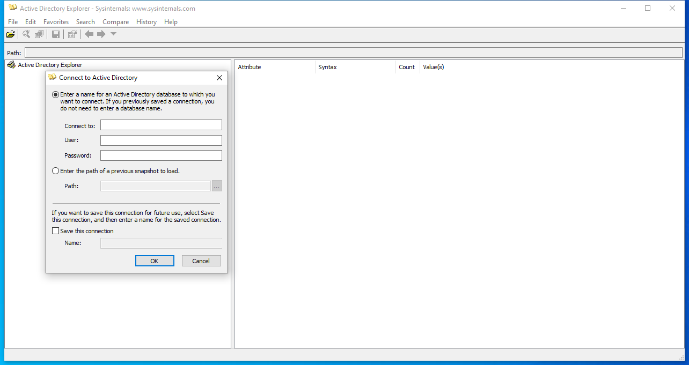

---
title: ADExplorer.exe | Active Directory Editor
excerpt: What is ADExplorer.exe?
---

# ADExplorer.exe 

* File Path: `C:\SysinternalsSuite\ADExplorer.exe`
* Description: Active Directory Editor

## Screenshot

## Hashes

Type | Hash
-- | --
MD5 | `5D70CF91907165A1425E4ECB4FFA03AA`
SHA1 | `BC1D7C9968EE92431F8AD9B4F8063B5B56F32AD5`
SHA256 | `BB45D8FFE245C361C04CCA44D0DF6E6BD7596CABD70070FFE0D9F519E3B620EA`
SHA384 | `DEB7B3256A8D121B4C384FD4532D4359D9B42979ECABA275FFA73AE5CE110B2858C1D0D4E3D2597983C0F1473848C1E7`
SHA512 | `FA92E37A6CF5B5EB1F107DC3153FCA20F2F041160A61033BAC5B6EDDE68F759EF97967DFDBA734E11F20A429DF53F9CD1E0A24AA5541F69749F403387AA70C7F`
SSDEEP | `12288:QJB9/HQLmTMga6JzQdrAVzDtpzO9LZvYC:QCLmwgza2VzSLZvB`
IMP | `FC22A526C18358F987F144E2AC31D338`
PESHA1 | `04A702ECDA741E4373118763B3E4CC5C8A2F8C31`
PE256 | `680137DB2F2A8D809254BC013FB5D2254877DF6A74618CCD6D8BDAE3572B1425`

## Runtime Data

### Window Title:
Active Directory Explorer

### Open Handles:

Path | Type
-- | --
(R-D)   C:\Windows\Fonts\StaticCache.dat | File
(R-D)   C:\Windows\SystemResources\imageres.dll.mun | File
(RW-)   C:\Windows | File
(RW-)   C:\Windows\WinSxS\x86_microsoft.windows.common-controls_6595b64144ccf1df_6.0.19041.488_none_11b1e5df2ffd8627 | File
(RW-)   C:\xCyclopedia | File
\BaseNamedObjects\NLS_CodePage_1252_3_2_0_0 | Section
\BaseNamedObjects\NLS_CodePage_437_3_2_0_0 | Section
\Sessions\1\Windows\Theme2036293991 | Section
\Windows\Theme1324212991 | Section

### Loaded Modules:

Path |
-- |
C:\SysinternalsSuite\ADExplorer.exe |
C:\Windows\SYSTEM32\ntdll.dll |
C:\Windows\System32\wow64.dll |
C:\Windows\System32\wow64cpu.dll |
C:\Windows\System32\wow64win.dll |

## Signature

* Status: Signature verified.
* Serial: `330000009D1E8D27AEB8F3D83800010000009D`
* Thumbprint: `AC1FD0922A4A2A6E5779ACDD628747C28394B0B9`
* Issuer: CN=Microsoft Code Signing PCA, O=Microsoft Corporation, L=Redmond, S=Washington, C=US
* Subject: CN=Microsoft Corporation, OU=MOPR, O=Microsoft Corporation, L=Redmond, S=Washington, C=US

## File Metadata

* Original Filename: AdExp
* Product Name: Sysinternals ADExplorer
* Company Name: Sysinternals - www.sysinternals.com
* File Version: 1.44
* Product Version: 1.44
* Language: English (United States)
* Legal Copyright: Copyright  2007-2012 Bryce Cogswell and Mark Russinovich
* Machine Type: 32-bit

## File Scan

* VirusTotal Detections: 0/68
* VirusTotal Link: https://www.virustotal.com/gui/file/bb45d8ffe245c361c04cca44d0df6e6bd7596cabd70070ffe0d9f519e3b620ea/detection/

## Possible Misuse

*The following table contains possible examples of `ADExplorer.exe` being misused. While `ADExplorer.exe` is **not** inherently malicious, its legitimate functionality can be abused for malicious purposes.*

Source | Source File | Example | License
-- | -- | -- | --
[sigma](https://github.com/Neo23x0/sigma) | [win_apt_bear_activity_gtr19.yml](https://github.com/Neo23x0/sigma/blob/master/rules/windows/process_creation/win_apt_bear_activity_gtr19.yml) | `Image: '*\adexplorer.exe'`{:.highlight .language-yaml} | [DRL 1.0](https://github.com/Neo23x0/sigma/blob/master/LICENSE.Detection.Rules.md)

MIT License. Copyright (c) 2020-2021 Strontic.

