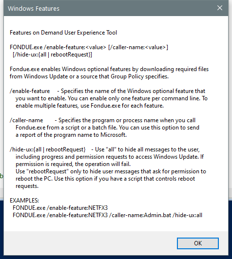

---
title: Fondue.exe | Windows Features on Demand UX
excerpt: What is Fondue.exe?
---

# Fondue.exe 

* File Path: `C:\Windows\SysWOW64\Fondue.exe`
* Description: Windows Features on Demand UX

## Screenshot



## Hashes

Type | Hash
-- | --
MD5 | `0E9BE52DB9A66E19CF012D33E10E5EA7`
SHA1 | `51296EF62A0AA10ED107D89D03F1D268B4451CCF`
SHA256 | `CE88D88E233A9AB9B47BEA00AF705ECF49869BE78E671BD09AA4F7D5A34C9953`
SHA384 | `CDEFA2895FA1380C3CF8FD37D450397AFDCEB8C5BCB648E845A0DB94C28EBF22EA435B1002A959D22BAED48474C9BE7E`
SHA512 | `C4E3C7319C3536BB04312068D5C9BA89ACD0A7EC0D6C6E7EEA0F5881317FAF4FF83EF95E12C2835DEC4401353916275C600D0A6CC6F3A69C6F51808CDDFFA4A7`
SSDEEP | `3072:DM5ObEaznWfH22ZsuX2xKwMPTnaSrIrvD2:MoznWjZnXeKwMLnaqY`
IMP | `C90A9B51B5004E7BF81F560D871186E8`
PESHA1 | `D05AC06EA055F0C25E017EE3170F7EE3FAB8E76D`
PE256 | `E094A15283B13A324333CDDADC065422790A61F80C2B135AB0B0DC2111B471CA`

## Runtime Data

### Child Processes:
Fondue.exe

### Open Handles:

Path | Type
-- | --
(R-D)   C:\Windows\SysWOW64\en-US\Fondue.exe.mui | File
(R-D)   C:\Windows\SysWOW64\en-US\propsys.dll.mui | File
(RW-)   C:\Users\user | File
(RW-)   C:\Windows | File
(RW-)   C:\Windows\WinSxS\x86_microsoft.windows.common-controls_6595b64144ccf1df_6.0.17763.1518_none_261b62a767ca4e6d | File
\BaseNamedObjects\__ComCatalogCache__ | Section
\BaseNamedObjects\C:\*ProgramData\*Microsoft\*Windows\*Caches\*{6AF0698E-D558-4F6E-9B3C-3716689AF493}.2.ver0x0000000000000004.db | Section
\BaseNamedObjects\C:\*ProgramData\*Microsoft\*Windows\*Caches\*{DDF571F2-BE98-426D-8288-1A9A39C3FDA2}.2.ver0x0000000000000004.db | Section
\BaseNamedObjects\C:\*ProgramData\*Microsoft\*Windows\*Caches\*cversions.2.ro | Section
\BaseNamedObjects\NLS_CodePage_1252_3_2_0_0 | Section
\BaseNamedObjects\NLS_CodePage_437_3_2_0_0 | Section
\BaseNamedObjects\windows_shell_global_counters | Section
\RPC Control\DSECDA4 | Section
\Sessions\2\BaseNamedObjects\UrlZonesSM_Administrator | Section
\Sessions\2\BaseNamedObjects\windows_shell_global_counters | Section


### Loaded Modules:

Path |
-- |
C:\Windows\SYSTEM32\ntdll.dll |
C:\Windows\System32\wow64.dll |
C:\Windows\System32\wow64cpu.dll |
C:\Windows\System32\wow64win.dll |
C:\Windows\SysWOW64\Fondue.exe |


## Signature

* Status: Signature verified.
* Serial: `33000001C422B2F79B793DACB20000000001C4`
* Thumbprint: `AE9C1AE54763822EEC42474983D8B635116C8452`
* Issuer: CN=Microsoft Windows Production PCA 2011, O=Microsoft Corporation, L=Redmond, S=Washington, C=US
* Subject: CN=Microsoft Windows, O=Microsoft Corporation, L=Redmond, S=Washington, C=US

## File Metadata

* Original Filename: Fondue.EXE.MUI
* Product Name: Microsoft Windows Operating System
* Company Name: Microsoft Corporation
* File Version: 10.0.17763.1 (WinBuild.160101.0800)
* Product Version: 10.0.17763.1
* Language: English (United States)
* Legal Copyright:  Microsoft Corporation. All rights reserved.
* Machine Type: 32-bit

## File Scan

* VirusTotal Detections: 0/70
* VirusTotal Link: https://www.virustotal.com/gui/file/ce88d88e233a9ab9b47bea00af705ecf49869be78e671bd09aa4f7d5a34c9953/detection/

## File Similarity (ssdeep match)

File | Score
-- | --
[C:\Windows\system32\Fondue.exe](Fondue.exe-237E1F3944532E26BB1EB945798DB582.md) | 85
[C:\windows\system32\Fondue.exe](Fondue.exe-506659C0225E2D8C2513238424AF9ADF.md) | 93
[C:\WINDOWS\system32\Fondue.exe](Fondue.exe-79DF3567F912F45AE9BC0664A397C858.md) | 83
[C:\WINDOWS\system32\Fondue.exe](Fondue.exe-B2394CA80127A7BAB628DA4F5D629DA8.md) | 85
[C:\Windows\system32\Fondue.exe](Fondue.exe-EEE0F4A169799F00BAD87C7D0834E348.md) | 86
[C:\Windows\system32\Fondue.exe](Fondue.exe-F995D2EF9220F33C260425DB39ED05A3.md) | 91
[C:\WINDOWS\system32\OptionalFeatures.exe](OptionalFeatures.exe-18FDAD8492E77DC6C6AD062F9AB7524B.md) | 82
[C:\Windows\system32\OptionalFeatures.exe](OptionalFeatures.exe-9BDA0F9DCFDB837F1A5298940EC51B9A.md) | 85
[C:\Windows\system32\OptionalFeatures.exe](OptionalFeatures.exe-D6CD8BEF71458804DBC33B88ACE56372.md) | 90
[C:\WINDOWS\system32\OptionalFeatures.exe](OptionalFeatures.exe-EF0418CF89AD1C48D855A11F162AA08D.md) | 88
[C:\Windows\system32\OptionalFeatures.exe](OptionalFeatures.exe-F5E6A72C8DC8F430EB2C56958665EBA6.md) | 88
[C:\WINDOWS\SysWOW64\Fondue.exe](Fondue.exe-13C83CB32EE31E91B85EE5F499BCB13C.md) | 90
[C:\windows\SysWOW64\Fondue.exe](Fondue.exe-177C1130949E620616BA63D9D27913FE.md) | 83
[C:\WINDOWS\SysWOW64\Fondue.exe](Fondue.exe-1A274BFE1306A75C215A832F274F4E44.md) | 86
[C:\Windows\SysWOW64\Fondue.exe](Fondue.exe-69A312336DBCAE207F5D8C04520B9B3C.md) | 88
[C:\Windows\SysWOW64\Fondue.exe](Fondue.exe-EEEA1F28FE960B2CA15A199B8EE96E5E.md) | 90


## Additional Info*

**The information below is copied from [MicrosoftDocs](https://github.com/MicrosoftDocs/windowsserverdocs), which is maintained by [Microsoft](https://opensource.microsoft.com/codeofconduct/). Available under [CC BY 4.0](https://creativecommons.org/licenses/by/4.0/) license.*

---

## fondue

>Applies to: Windows Server 2022, Windows Server 2019, Windows Server 2016, Windows Server 2012 R2, Windows Server 2012

Enables Windows optional features by downloading required files from Windows Update or another source specified by Group Policy. The manifest file for the feature must already be installed in your Windows image.

### Syntax

```
fondue.exe /enable-feature:<feature_name> [/caller-name:<program_name>] [/hide-ux:{all | rebootrequest}]
```

#### Parameters

| Parameter | Description |
| --------- | ----------- |
| /enable-feature:`<feature_name>` | Specifies the name of the Windows optional feature you want to enable. You can only enable one feature per command line. To enable multiple features, use fondue.exe for each feature. |
| /caller-name:`<program_name>` | Specifies the program or process name when you call fondue.exe from a script or batch file. You can use this option to add the program name to the SQM report if there is an error. |
| /hide-ux:`{all | rebootrequest}` | Use **all** to hide all messages to the user including progress and permission requests to access Windows Update. If permission is required, the operation will fail.<p>Use **rebootrequest** to only hide user messages asking for permission to reboot the computer. Use this option if you have a script that controls reboot requests. |

#### Examples

To enable Microsoft .NET Framework 4.8, type:

```
fondue.exe /enable-feature:NETFX4
```

To enable Microsoft .NET Framework 4.8, add the program name to the SQM report, and not display messages to the user, type:

```
fondue.exe /enable-feature:NETFX4 /caller-name:Admin.bat /hide-ux:all
```

### Additional References

- [Command-Line Syntax Key](https://github.com/MicrosoftDocs/windowsserverdocs/tree/master/WindowsServerDocs/administration/windows-commands/command-line-syntax-key.md)

- [Microsoft .NET Framework 4.8 Download](https://dotnet.microsoft.com/download/dotnet-framework/net48)

---


MIT License. Copyright (c) 2020-2021 Strontic.


