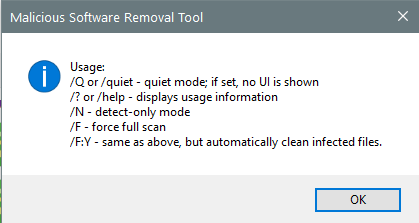

---
title: MRT.exe | Microsoft Windows Malicious Software Removal Tool
excerpt: What is MRT.exe?
---

# MRT.exe 

* File Path: `C:\WINDOWS\system32\MRT.exe`
* Description: Microsoft Windows Malicious Software Removal Tool

## Screenshot

## Hashes

Type | Hash
-- | --
MD5 | `68E0F8F82B7EFFC1081B3FBED8FB0F39`
SHA1 | `729398C5CE1CC00E94C5C0D105B66428FCBB54B9`
SHA256 | `27CB2F21EB3F4EF1CC44E58CBECABA81ADB91CBE6E39B86C3C6599F05DB3C659`
SHA384 | `C282EC48BAABB92EA31D4A38F82BE924868297498C65B5C47FB50D56483C9B3BC9695D17E4FED32DA13986F60428AE3B`
SHA512 | `001508A829320E507336C4C512E1B28C3AFE51C0211531C5B9726BF7551B673D01A9DB3AF4FE2677CD050582CF9E26617D0E06AD9CFEBFAE1A966FF184FB61E8`
SSDEEP | ``
IMP | `05D7D27EC48BB0EEDC2DFD4AB9610950`
PESHA1 | `7A573A5CD9CAE76FA65F1A911FAE7BDB1B04D292`
PE256 | `181E69B982C498AF406A70F4EAB7C9F71E4AA0A1609E45F7ABE1F5DF15687228`

## Runtime Data

### Window Title:
Malicious Software Removal Tool

### Open Handles:

Path | Type
-- | --
(R-D)   C:\Windows\Fonts\StaticCache.dat | File
(R-D)   C:\Windows\SystemResources\imageres.dll.mun | File
(RW-)   C:\Windows\System32 | File
(RW-)   C:\Windows\WinSxS\amd64_microsoft.windows.common-controls_6595b64144ccf1df_6.0.22000.120_none_9d947278b86cc467 | File
\BaseNamedObjects\C:\*ProgramData\*Microsoft\*Windows\*Caches\*{6AF0698E-D558-4F6E-9B3C-3716689AF493}.2.ver0x0000000000000001.db | Section
\BaseNamedObjects\C:\*ProgramData\*Microsoft\*Windows\*Caches\*{DDF571F2-BE98-426D-8288-1A9A39C3FDA2}.2.ver0x0000000000000001.db | Section
\BaseNamedObjects\C:\*ProgramData\*Microsoft\*Windows\*Caches\*cversions.2.ro | Section
\Sessions\2\BaseNamedObjects\NLS_CodePage_1252_3_2_0_0 | Section
\Sessions\2\BaseNamedObjects\NLS_CodePage_437_3_2_0_0 | Section
\Sessions\2\Windows\Theme1077709572 | Section
\Windows\Theme3461253685 | Section

### Loaded Modules:

Path |
-- |
C:\WINDOWS\System32\ADVAPI32.dll |
C:\WINDOWS\System32\GDI32.dll |
C:\WINDOWS\System32\KERNEL32.DLL |
C:\WINDOWS\System32\KERNELBASE.dll |
C:\WINDOWS\system32\MRT.exe |
C:\WINDOWS\System32\msvcrt.dll |
C:\WINDOWS\SYSTEM32\ntdll.dll |
C:\WINDOWS\System32\RPCRT4.dll |
C:\WINDOWS\System32\sechost.dll |
C:\WINDOWS\System32\USER32.dll |
C:\WINDOWS\System32\win32u.dll |

## Signature

* Status: Signature verified.
* Serial: `33000002DD8770F52ABEFDE3430000000002DD`
* Thumbprint: `03BA55C2D33043729461269EB3A9B5D3AC83DECD`
* Issuer: CN=Microsoft Windows Production PCA 2011, O=Microsoft Corporation, L=Redmond, S=Washington, C=US
* Subject: CN=Microsoft Windows, O=Microsoft Corporation, L=Redmond, S=Washington, C=US

## File Metadata

* Original Filename: mrt.exe
* Product Name: Microsoft Windows Malicious Software Removal Tool
* Company Name: Microsoft Corporation
* File Version: 5.94.18626.1
* Product Version: 5.94.18626.1
* Language: English (United States)
* Legal Copyright:  Microsoft Corporation. All rights reserved.
* Machine Type: 64-bit

## File Scan

* VirusTotal Detections: 0/73
* VirusTotal Link: https://www.virustotal.com/gui/file/27cb2f21eb3f4ef1cc44e58cbecaba81adb91cbe6e39b86c3c6599f05db3c659/detection

## Possible Misuse

*The following table contains possible examples of `MRT.exe` being misused. While `MRT.exe` is **not** inherently malicious, its legitimate functionality can be abused for malicious purposes.*

Source | Source File | Example | License
-- | -- | -- | --
[sigma](https://github.com/Neo23x0/sigma) | [win_susp_svchost.yml](https://github.com/Neo23x0/sigma/blob/master/rules/windows/process_creation/win_susp_svchost.yml) | `- '\Mrt.exe'`{:.highlight .language-yaml} | [DRL 1.0](https://github.com/Neo23x0/sigma/blob/master/LICENSE.Detection.Rules.md)
[signature-base](https://github.com/Neo23x0/signature-base) | [crime_fireball.yar](https://github.com/Neo23x0/signature-base/blob/master/yara/crime_fireball.yar) | $x1 = "SOFTWARE\\Microsoft\\Windows NT\\CurrentVersion\\Image File Execution Options\\MRT.exe" fullword wide | [CC BY-NC 4.0](https://github.com/Neo23x0/signature-base/blob/master/LICENSE)

MIT License. Copyright (c) 2020-2021 Strontic.

