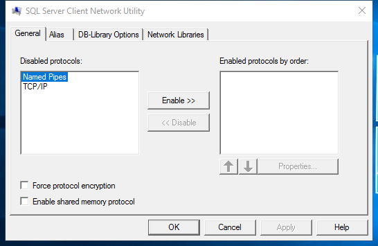

---
title: cliconfg.exe | SQL Client Configuration Utility EXE
excerpt: What is cliconfg.exe?
---

# cliconfg.exe 

* File Path: `C:\Windows\system32\cliconfg.exe`
* Description: SQL Client Configuration Utility EXE

## Screenshot

## Hashes

Type | Hash
-- | --
MD5 | `E06C0D21FFE629D45E3F0067B86D2CEA`
SHA1 | `05EEA2A01A7B63B43D8F465D190D206A890F3F30`
SHA256 | `5B223B5BD106FF17C7817858CB6C371A055B54486E4C351CA952D6CD83A2DA88`
SHA384 | `80D46CF053546942C5428B762DFD67B5148C4215F8E22C71980D66049F37BC14FC5887A8930EDA887854586205DBBA86`
SHA512 | `9409D6D1C7BA6F069A551A37A20AF278EDE5DB452974FD7B853722A96FE24B5C1A1D3BF251D52846067CA479B0697F92E16DF236E6FEB297331AAE8DB3C419F0`
SSDEEP | `384:+TO+UvOyKBxv9CtYUJW0wWFPXuNvBQAMYJQ2JQSkdowyo:+TO+UvOBxtU5ruI30lJBkvT`
IMP | `E0A4A433A88E43CFE20831B905227E5B`
PESHA1 | `6DCB70EB815E35D6D62E1F0A3B2B79DA4F34D426`
PE256 | `EA2DFE75AC0C30183B7726DACBD43901F86291DB464044217804673A47B59286`

## Runtime Data

### Window Title:
SQL Server Client Network Utility

### Open Handles:

Path | Type
-- | --
(R-D)   C:\Windows\Fonts\StaticCache.dat | File
(R-D)   C:\Windows\System32\en-US\cliconfg.rll.mui | File
(R-D)   C:\Windows\WinSxS\amd64_microsoft.windows.c..-controls.resources_6595b64144ccf1df_5.82.19041.1_en-us_6144a36069349598\comctl32.dll.mui | File
(RW-)   C:\Users\user | File
(RW-)   C:\Windows\WinSxS\amd64_microsoft.windows.c..-controls.resources_6595b64144ccf1df_5.82.19041.1_en-us_6144a36069349598 | File
(RW-)   C:\Windows\WinSxS\amd64_microsoft.windows.common-controls_6595b64144ccf1df_5.82.19041.488_none_4238de57f6b64d28 | File
\BaseNamedObjects\C:\*ProgramData\*Microsoft\*Windows\*Caches\*{6AF0698E-D558-4F6E-9B3C-3716689AF493}.2.ver0x0000000000000002.db | Section
\BaseNamedObjects\C:\*ProgramData\*Microsoft\*Windows\*Caches\*{DDF571F2-BE98-426D-8288-1A9A39C3FDA2}.2.ver0x0000000000000002.db | Section
\BaseNamedObjects\C:\*ProgramData\*Microsoft\*Windows\*Caches\*cversions.2 | Section
\BaseNamedObjects\NLS_CodePage_1252_3_2_0_0 | Section
\BaseNamedObjects\NLS_CodePage_437_3_2_0_0 | Section
\Sessions\1\Windows\Theme1800662698 | Section
\Windows\Theme722103516 | Section

### Loaded Modules:

Path |
-- |
C:\Windows\system32\cliconfg.exe |
C:\Windows\System32\combase.dll |
C:\Windows\System32\GDI32.dll |
C:\Windows\System32\gdi32full.dll |
C:\Windows\System32\IMM32.DLL |
C:\Windows\System32\KERNEL32.DLL |
C:\Windows\System32\KERNELBASE.dll |
C:\Windows\System32\msvcp_win.dll |
C:\Windows\System32\msvcrt.dll |
C:\Windows\SYSTEM32\ntdll.dll |
C:\Windows\System32\RPCRT4.dll |
C:\Windows\System32\ucrtbase.dll |
C:\Windows\System32\USER32.dll |
C:\Windows\system32\uxtheme.dll |
C:\Windows\System32\win32u.dll |

## Signature

* Status: Signature verified.
* Serial: `3300000266BD1580EFA75CD6D3000000000266`
* Thumbprint: `A4341B9FD50FB9964283220A36A1EF6F6FAA7840`
* Issuer: CN=Microsoft Windows Production PCA 2011, O=Microsoft Corporation, L=Redmond, S=Washington, C=US
* Subject: CN=Microsoft Windows, O=Microsoft Corporation, L=Redmond, S=Washington, C=US

## File Metadata

* Original Filename: cliconfg.exe
* Product Name: Microsoft Windows Operating System
* Company Name: Microsoft Corporation
* File Version: 10.0.19041.1 (WinBuild.160101.0800)
* Product Version: 10.0.19041.1
* Language: English (United States)
* Legal Copyright:  Microsoft Corporation. All rights reserved.
* Machine Type: 64-bit

## File Scan

* VirusTotal Detections: 0/75
* VirusTotal Link: https://www.virustotal.com/gui/file/5b223b5bd106ff17c7817858cb6c371a055b54486e4c351ca952d6cd83a2da88/detection

## File Similarity (ssdeep match)

File | Score
-- | --
[C:\windows\system32\cliconfg.exe](cliconfg.exe-1A81668402876DBDE84C5E111C8D4A78.md) | 61
[C:\WINDOWS\system32\cliconfg.exe](cliconfg.exe-23270B94D888BC3AC565E97C8DD6F4BB.md) | 61
[C:\Windows\system32\cliconfg.exe](cliconfg.exe-2F01F4A027E09027DBD2651FF3359DF9.md) | 60
[C:\Windows\system32\cliconfg.exe](cliconfg.exe-FF9932C30F72B19E57D9B07F230487E7.md) | 60
[C:\WINDOWS\SysWOW64\cliconfg.exe](cliconfg.exe-588677B78E8431F7822DB276E75D4DD7.md) | 65
[C:\Windows\SysWOW64\cliconfg.exe](cliconfg.exe-5924FC77AC5B646CCF8CEF54DBED2D69.md) | 66
[C:\Windows\SysWOW64\cliconfg.exe](cliconfg.exe-5EE49921CB7AEA9FDF2938F99DB69FFA.md) | 69
[C:\Windows\SysWOW64\cliconfg.exe](cliconfg.exe-8479031B34E1F72E08EB5EC618368822.md) | 58
[C:\windows\SysWOW64\cliconfg.exe](cliconfg.exe-D742C17757BA63F0FB22715C3E0CFF68.md) | 66

## Possible Misuse

*The following table contains possible examples of `cliconfg.exe` being misused. While `cliconfg.exe` is **not** inherently malicious, its legitimate functionality can by abused for malicious purposes.*

Source | Source File | Example | License
-- | -- | -- | --
[signature-base](https://github.com/Neo23x0/signature-base) | [apt_op_honeybee.yar](https://github.com/Neo23x0/signature-base/blob/master/yara/apt_op_honeybee.yar) | $x2 = "del /f /q %TEMP%\\setup.cab && cliconfg.exe" | [CC BY-NC 4.0](https://github.com/Neo23x0/signature-base/blob/master/LICENSE)
[signature-base](https://github.com/Neo23x0/signature-base) | [apt_op_honeybee.yar](https://github.com/Neo23x0/signature-base/blob/master/yara/apt_op_honeybee.yar) | $x1 = "cmd /c taskkill /im cliconfg.exe /f /t && del /f /q" fullword ascii | [CC BY-NC 4.0](https://github.com/Neo23x0/signature-base/blob/master/LICENSE)

MIT License. Copyright (c) 2020 Strontic.

