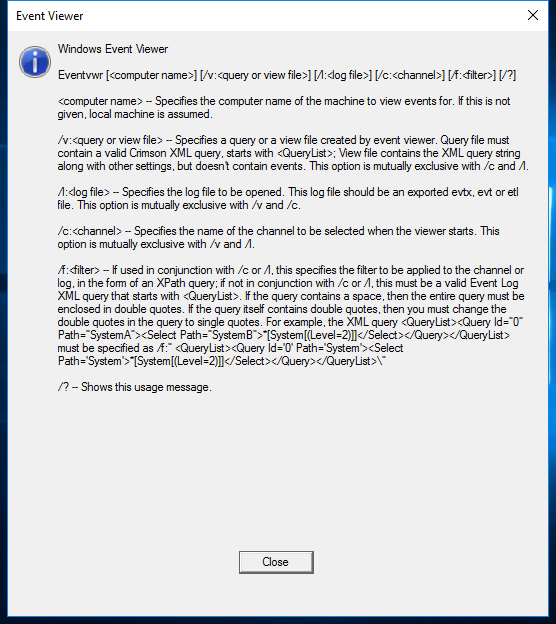

---
title: eventvwr.exe | Event Viewer Snapin Launcher
excerpt: What is eventvwr.exe?
---

# eventvwr.exe 

* File Path: `C:\windows\system32\eventvwr.exe`
* Description: Event Viewer Snapin Launcher

## Screenshot

## Hashes

Type | Hash
-- | --
MD5 | `0464030A3293F289612E6C24D173C11C`
SHA1 | `7C4CD00BEE3CC7FA40241BD1E14DCCE46282EBBE`
SHA256 | `C720C4ED36F041A76F70331BE3C2B3B98E1A7D31825D03F5A26E21BA73034B22`
SHA384 | `D839B0645E2D069BE83A99D0E81BD28208E0FD9E528A9F8139947D7AE8E7CB12AEF42405677B834F896C02A2E9EBBA97`
SHA512 | `84CADAE51BB0E7903947E6DD2F308146C35FE2179BF37327D2D52A6F7B6C0EFF911C0184ED4F210FEF00057A1B7B46EFE1381A1D89DF3C8C0EA22E2A88ADCBA7`
SSDEEP | `1536:+b6HYJ37B5IMfoJUhSU6nPlTggJ2oj71BgR/Vp8dY1g:+bNRv3lhzslTZJ9j7Heb8C1g`

## Signature

* Status: The file C:\windows\system32\eventvwr.exe is not digitally signed. You cannot run this script on the current system. For more information about running scripts and setting execution policy, see about_Execution_Policies at http://go.microsoft.com/fwlink/?LinkID=135170
* Serial: ``
* Thumbprint: ``
* Issuer: 
* Subject: 

## File Metadata

* Original Filename: eventvwr.exe.mui
* Product Name: Microsoft Windows Operating System
* Company Name: Microsoft Corporation
* File Version: 6.3.9600.16384 (winblue_rtm.130821-1623)
* Product Version: 6.3.9600.16384
* Language: English (United States)
* Legal Copyright:  Microsoft Corporation. All rights reserved.

## File Similarity (ssdeep match)

File | Score
-- | --
[C:\Windows\system32\eventvwr.exe](eventvwr.exe-16DF74906C84D249F47C3709F47DF6C3.md) | 80
[C:\Windows\system32\eventvwr.exe](eventvwr.exe-3A8EBEB41000296D44EDDF39A505F7E0.md) | 79
[C:\Windows\system32\eventvwr.exe](eventvwr.exe-43129C3BFC9746CE9FFE8E45D10FE050.md) | 85
[C:\WINDOWS\system32\eventvwr.exe](eventvwr.exe-FA45FA43F689529F653470691BBF53A3.md) | 88
[C:\Windows\system32\miguiresource.dll](miguiresource.dll-CB612BD0353BA7151C1E6898B6E962C8.md) | 50
[C:\Windows\SysWOW64\eventvwr.exe](eventvwr.exe-0B6FEE1C98B1290BB4C05596A37B8EE2.md) | 88
[C:\WINDOWS\SysWOW64\eventvwr.exe](eventvwr.exe-30F9C40400D0874235F16BEBBD56D1A5.md) | 83
[C:\windows\SysWOW64\eventvwr.exe](eventvwr.exe-518D6C4D2BE74587F0D8C2AA6733140A.md) | 86
[C:\Windows\SysWOW64\eventvwr.exe](eventvwr.exe-836D39AD5985CA36F9583D160F858D68.md) | 83
[C:\Windows\SysWOW64\eventvwr.exe](eventvwr.exe-B16623FDB9C4EB80BEC647F082D34969.md) | 83
[C:\Windows\SysWOW64\miguiresource.dll](miguiresource.dll-C74A6CA1398B880651116890134EA70E.md) | 54

## Possible Misuse

*The following table contains possible examples of `eventvwr.exe` being misused. While `eventvwr.exe` is **not** inherently malicious, its legitimate functionality can be abused for malicious purposes.*

Source | Source File | Example | License
-- | -- | -- | --
[sigma](https://github.com/Neo23x0/sigma) | [process_creation_sysmon_uac_bypass_eventvwr.yml](https://github.com/Neo23x0/sigma/blob/master/rules/windows/process_creation/process_creation_sysmon_uac_bypass_eventvwr.yml) | `- https://enigma0x3.net/2016/08/15/fileless-uac-bypass-using-eventvwr-exe-and-registry-hijacking/`{:.highlight .language-yaml} | [DRL 1.0](https://github.com/Neo23x0/sigma/blob/master/LICENSE.Detection.Rules.md)
[sigma](https://github.com/Neo23x0/sigma) | [process_creation_sysmon_uac_bypass_eventvwr.yml](https://github.com/Neo23x0/sigma/blob/master/rules/windows/process_creation/process_creation_sysmon_uac_bypass_eventvwr.yml) | `ParentImage\|endswith: '\eventvwr.exe'`{:.highlight .language-yaml} | [DRL 1.0](https://github.com/Neo23x0/sigma/blob/master/LICENSE.Detection.Rules.md)
[sigma](https://github.com/Neo23x0/sigma) | [win_task_folder_evasion.yml](https://github.com/Neo23x0/sigma/blob/master/rules/windows/process_creation/win_task_folder_evasion.yml) | `description: The Tasks folder in system32 and syswow64 are globally writable paths. Adversaries can take advantage of this and load or influence any script hosts or ANY .NET Application in Tasks to load and execute a custom assembly into cscript, wscript, regsvr32, mshta, eventvwr`{:.highlight .language-yaml} | [DRL 1.0](https://github.com/Neo23x0/sigma/blob/master/LICENSE.Detection.Rules.md)
[sigma](https://github.com/Neo23x0/sigma) | [win_uac_bypass_wmp.yml](https://github.com/Neo23x0/sigma/blob/master/rules/windows/process_creation/win_uac_bypass_wmp.yml) | `ParentCommandLine: '"C:\Windows\system32\mmc.exe" "C:\Windows\system32\eventvwr.msc" /s'`{:.highlight .language-yaml} | [DRL 1.0](https://github.com/Neo23x0/sigma/blob/master/LICENSE.Detection.Rules.md)
[sigma](https://github.com/Neo23x0/sigma) | [registry_event_uac_bypass_eventvwr.yml](https://github.com/Neo23x0/sigma/blob/master/rules/windows/registry_event/registry_event_uac_bypass_eventvwr.yml) | `- https://enigma0x3.net/2016/08/15/fileless-uac-bypass-using-eventvwr-exe-and-registry-hijacking/`{:.highlight .language-yaml} | [DRL 1.0](https://github.com/Neo23x0/sigma/blob/master/LICENSE.Detection.Rules.md)
[LOLBAS](https://github.com/LOLBAS-Project/LOLBAS) | [Eventvwr.yml](https://github.com/LOLBAS-Project/LOLBAS/blob/master/yml/OSBinaries/Eventvwr.yml) | `Name: Eventvwr.exe`{:.highlight .language-yaml} | 
[LOLBAS](https://github.com/LOLBAS-Project/LOLBAS) | [Eventvwr.yml](https://github.com/LOLBAS-Project/LOLBAS/blob/master/yml/OSBinaries/Eventvwr.yml) | `- Command: eventvwr.exe`{:.highlight .language-yaml} | 
[LOLBAS](https://github.com/LOLBAS-Project/LOLBAS) | [Eventvwr.yml](https://github.com/LOLBAS-Project/LOLBAS/blob/master/yml/OSBinaries/Eventvwr.yml) | `Description: During startup, eventvwr.exe checks the registry value HKCU\Software\Classes\mscfile\shell\open\command for the location of mmc.exe, which is used to open the eventvwr.msc saved console file. If the location of another binary or script is added to this registry value, it will be executed as a high-integrity process without a UAC prompt being displayed to the user.`{:.highlight .language-yaml} | 
[LOLBAS](https://github.com/LOLBAS-Project/LOLBAS) | [Eventvwr.yml](https://github.com/LOLBAS-Project/LOLBAS/blob/master/yml/OSBinaries/Eventvwr.yml) | `- Path: C:\Windows\System32\eventvwr.exe`{:.highlight .language-yaml} | 
[LOLBAS](https://github.com/LOLBAS-Project/LOLBAS) | [Eventvwr.yml](https://github.com/LOLBAS-Project/LOLBAS/blob/master/yml/OSBinaries/Eventvwr.yml) | `- Path: C:\Windows\SysWOW64\eventvwr.exe`{:.highlight .language-yaml} | 
[LOLBAS](https://github.com/LOLBAS-Project/LOLBAS) | [Eventvwr.yml](https://github.com/LOLBAS-Project/LOLBAS/blob/master/yml/OSBinaries/Eventvwr.yml) | `- IOC: eventvwr.exe launching child process other than mmc.exe`{:.highlight .language-yaml} | 
[LOLBAS](https://github.com/LOLBAS-Project/LOLBAS) | [Eventvwr.yml](https://github.com/LOLBAS-Project/LOLBAS/blob/master/yml/OSBinaries/Eventvwr.yml) | `- Link: https://enigma0x3.net/2016/08/15/fileless-uac-bypass-using-eventvwr-exe-and-registry-hijacking/`{:.highlight .language-yaml} | 
[malware-ioc](https://github.com/eset/malware-ioc) | [misp_invisimole.json](https://github.com/eset/malware-ioc/blob/master/invisimole/misp_invisimole.json) | `"description": "Windows User Account Control (UAC) allows a program to elevate its privileges to perform a task under administrator-level permissions by prompting the user for confirmation. The impact to the user ranges from denying the operation under high enforcement to allowing the user to perform the action if they are in the local administrators group and click through the prompt or allowing them to enter an administrator password to complete the action. (Citation: TechNet How UAC Works)\n\nIf the UAC protection level of a computer is set to anything but the highest level, certain Windows programs are allowed to elevate privileges or execute some elevated COM objects without prompting the user through the UAC notification box. (Citation: TechNet Inside UAC) (Citation: MSDN COM Elevation) An example of this is use of rundll32.exe to load a specifically crafted DLL which loads an auto-elevated COM object and performs a file operation in a protected directory which would typically require elevated access. Malicious software may also be injected into a trusted process to gain elevated privileges without prompting a user. (Citation: Davidson Windows) Adversaries can use these techniques to elevate privileges to administrator if the target process is unprotected.\n\nMany methods have been discovered to bypass UAC. The Github readme page for UACMe contains an extensive list of methods (Citation: Github UACMe) that have been discovered and implemented within UACMe, but may not be a comprehensive list of bypasses. Additional bypass methods are regularly discovered and some used in the wild, such as:\n\n* <code>eventvwr.exe</code> can auto-elevate and execute a specified binary or script. (Citation: enigma0x3 Fileless UAC Bypass) (Citation: Fortinet Fareit)\n\nAnother bypass is possible through some Lateral Movement techniques if credentials for an account with administrator privileges are known, since UAC is a single system security mechanism, and the privilege or integrity of a process running on one system will be unknown on lateral systems and default to high integrity. (Citation: SANS UAC Bypass)",`{:.highlight .language-cmhg} | [© ESET 2014-2018](https://github.com/eset/malware-ioc/blob/master/LICENSE)
[malware-ioc](https://github.com/eset/malware-ioc) | [misp_invisimole.json](https://github.com/eset/malware-ioc/blob/master/invisimole/misp_invisimole.json) | `"https://enigma0x3.net/2016/08/15/fileless-uac-bypass-using-eventvwr-exe-and-registry-hijacking/",`{:.highlight .language-cmhg} | [© ESET 2014-2018](https://github.com/eset/malware-ioc/blob/master/LICENSE)
[atomic-red-team](https://github.com/redcanaryco/atomic-red-team) | [T1548.002.md](https://github.com/redcanaryco/atomic-red-team/blob/master/atomics/T1548.002/T1548.002.md) | * <code>eventvwr.exe</code> can auto-elevate and execute a specified binary or script.(Citation: enigma0x3 Fileless UAC Bypass)(Citation: Fortinet Fareit) | [MIT License. © 2018 Red Canary](https://github.com/redcanaryco/atomic-red-team/blob/master/LICENSE.txt)
[atomic-red-team](https://github.com/redcanaryco/atomic-red-team) | [T1548.002.md](https://github.com/redcanaryco/atomic-red-team/blob/master/atomics/T1548.002/T1548.002.md) | Bypasses User Account Control using Event Viewer and a relevant Windows Registry modification. More information here - https://enigma0x3.net/2016/08/15/fileless-uac-bypass-using-eventvwr-exe-and-registry-hijacking/ | [MIT License. © 2018 Red Canary](https://github.com/redcanaryco/atomic-red-team/blob/master/LICENSE.txt)
[atomic-red-team](https://github.com/redcanaryco/atomic-red-team) | [T1548.002.md](https://github.com/redcanaryco/atomic-red-team/blob/master/atomics/T1548.002/T1548.002.md) | cmd.exe /c eventvwr.msc | [MIT License. © 2018 Red Canary](https://github.com/redcanaryco/atomic-red-team/blob/master/LICENSE.txt)
[atomic-red-team](https://github.com/redcanaryco/atomic-red-team) | [T1548.002.md](https://github.com/redcanaryco/atomic-red-team/blob/master/atomics/T1548.002/T1548.002.md) | PowerShell code to bypass User Account Control using Event Viewer and a relevant Windows Registry modification. More information here - https://enigma0x3.net/2016/08/15/fileless-uac-bypass-using-eventvwr-exe-and-registry-hijacking/ | [MIT License. © 2018 Red Canary](https://github.com/redcanaryco/atomic-red-team/blob/master/LICENSE.txt)
[atomic-red-team](https://github.com/redcanaryco/atomic-red-team) | [T1548.002.md](https://github.com/redcanaryco/atomic-red-team/blob/master/atomics/T1548.002/T1548.002.md) | Start-Process "C:\Windows\System32\eventvwr.msc" | [MIT License. © 2018 Red Canary](https://github.com/redcanaryco/atomic-red-team/blob/master/LICENSE.txt)
[atomic-red-team](https://github.com/redcanaryco/atomic-red-team) | [T1574.012.md](https://github.com/redcanaryco/atomic-red-team/blob/master/atomics/T1574.012/T1574.012.md) | Write-Host "executing eventvwr.msc" -ForegroundColor Cyan | [MIT License. © 2018 Red Canary](https://github.com/redcanaryco/atomic-red-team/blob/master/LICENSE.txt)
[atomic-red-team](https://github.com/redcanaryco/atomic-red-team) | [T1574.012.md](https://github.com/redcanaryco/atomic-red-team/blob/master/atomics/T1574.012/T1574.012.md) | START MMC.EXE EVENTVWR.MSC | [MIT License. © 2018 Red Canary](https://github.com/redcanaryco/atomic-red-team/blob/master/LICENSE.txt)
[signature-base](https://github.com/Neo23x0/signature-base) | [gen_cn_hacktools.yar](https://github.com/Neo23x0/signature-base/blob/master/yara/gen_cn_hacktools.yar) | $s12 = "eventvwr" fullword ascii | [CC BY-NC 4.0](https://github.com/Neo23x0/signature-base/blob/master/LICENSE)

MIT License. Copyright (c) 2020-2021 Strontic.

