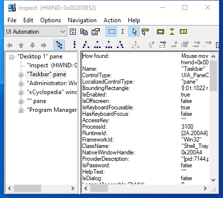

---
title: inspect.exe | Inspect Object (64-bit UNICODE Release)
excerpt: What is inspect.exe?
---

# inspect.exe 

* File Path: `C:\Program Files (x86)\Windows Kits\10\bin\10.0.19041.0\x64\inspect.exe`
* Description: Inspect Object (64-bit UNICODE Release)

## Screenshot

## Hashes

Type | Hash
-- | --
MD5 | `6F5AEEA6E52F989AB14616FE0BC9D668`
SHA1 | `638792706FCF3C2E57340EAAD63CF2FD94D5930F`
SHA256 | `ED318C1025044DF2DF14CD15C74C881B7298AE7A35C8F3750560C0BC6BA6C91B`
SHA384 | `A820F1893C204A4795BB30D34DBAD7D512307B2B6A835B0D95D082FCE37D44A7092AE4949C79CDB552A46D8295ABAA5A`
SHA512 | `6BD7C50416CA5E7611AD75DA814EC9562C4584DAB726FD3AF4EA07267B81DBE83A92916C975FEF5508CBFEE3B21392E0B8DBCF81170ECF40A77A6D5E29D72A36`
SSDEEP | `6144:jMnMskCWLUt2JyPe0/YRsO3UMKYMKI6UFj94:onMskCWjJyPe0/KsO3/m5Z94`
IMP | `23D8604B0919BB8B4C1AB9B1DD29F0AB`
PESHA1 | `906CF9963B091312CFBF92919AD71523C92BDFED`
PE256 | `8844199F8235AC305E018405E90C485F351105584982F3B7692974FBD554E986`

## Runtime Data

### Window Title:
Inspect  (HWND: 0x003B0858)

### Open Handles:

Path | Type
-- | --
(R-D)   C:\Windows\Fonts\StaticCache.dat | File
(R-D)   C:\Windows\System32\en-US\oleaccrc.dll.mui | File
(R-D)   C:\Windows\System32\en-US\UIAutomationCore.dll.mui | File
(RW-)   C:\Users\user | File
(RW-)   C:\Windows\System32 | File
(RW-)   C:\Windows\WinSxS\amd64_microsoft.windows.common-controls_6595b64144ccf1df_6.0.19041.488_none_ca04af081b815d21 | File
\BaseNamedObjects\__ComCatalogCache__ | Section
\BaseNamedObjects\C:\*ProgramData\*Microsoft\*Windows\*Caches\*{6AF0698E-D558-4F6E-9B3C-3716689AF493}.2.ver0x0000000000000002.db | Section
\BaseNamedObjects\C:\*ProgramData\*Microsoft\*Windows\*Caches\*{DDF571F2-BE98-426D-8288-1A9A39C3FDA2}.2.ver0x0000000000000002.db | Section
\BaseNamedObjects\C:\*ProgramData\*Microsoft\*Windows\*Caches\*cversions.2 | Section
\BaseNamedObjects\NLS_CodePage_1252_3_2_0_0 | Section
\BaseNamedObjects\NLS_CodePage_437_3_2_0_0 | Section
\Sessions\1\Windows\Theme1383959086 | Section
\Windows\Theme2042523233 | Section

### Loaded Modules:

Path |
-- |
C:\Program Files (x86)\Windows Kits\10\bin\10.0.19041.0\x64\inspect.exe |
C:\Windows\System32\ADVAPI32.dll |
C:\Windows\System32\GDI32.dll |
C:\Windows\System32\gdi32full.dll |
C:\Windows\System32\KERNEL32.DLL |
C:\Windows\System32\KERNELBASE.dll |
C:\Windows\System32\msvcrt.dll |
C:\Windows\SYSTEM32\ntdll.dll |
C:\Windows\System32\RPCRT4.dll |
C:\Windows\System32\sechost.dll |
C:\Windows\System32\win32u.dll |

## Signature

* Status: Signature verified.
* Serial: `33000002CF6D2CC57CAA65A6D80000000002CF`
* Thumbprint: `1A221B3B4FEF088B17BA6704FD088DF192D9E0EF`
* Issuer: CN=Microsoft Code Signing PCA 2010, O=Microsoft Corporation, L=Redmond, S=Washington, C=US
* Subject: CN=Microsoft Corporation, O=Microsoft Corporation, L=Redmond, S=Washington, C=US

## File Metadata

* Original Filename: INSPECT.EXE
* Product Name: Microsoft Active Accessibility
* Company Name: Microsoft Corporation
* File Version: 7.2.0.0
* Product Version: 7.2.0.0
* Language: English (United States)
* Legal Copyright:  2012 Microsoft Corporation. All rights reserved.
* Machine Type: 64-bit

## File Scan

* VirusTotal Detections: Unknown
* VirusTotal Link: n/a

## File Similarity (ssdeep match)

File | Score
-- | --
[C:\Program Files (x86)\Windows Kits\10\bin\10.0.19041.0\arm64\accevent.exe](accevent.exe-EE4E6F4157D2F4A00810ECF85D685644.md) | 33
[C:\Program Files (x86)\Windows Kits\10\bin\10.0.19041.0\arm64\inspect.exe](inspect.exe-C2BE3E8768023C282F359DDC71B9D2C0.md) | 43
[C:\Program Files (x86)\Windows Kits\10\bin\10.0.19041.0\x64\accevent.exe](accevent.exe-499CAE98F79635D60CC333400963554E.md) | 30

## Possible Misuse

*The following table contains possible examples of `inspect.exe` being misused. While `inspect.exe` is **not** inherently malicious, its legitimate functionality can be abused for malicious purposes.*

Source | Source File | Example | License
-- | -- | -- | --
[malware-ioc](https://github.com/eset/malware-ioc) | [oceanlotus-rtf_ocx_campaigns.misp.event.json](https://github.com/eset/malware-ioc/blob/master/oceanlotus/oceanlotus-rtf_ocx_campaigns.misp.event.json) | `"description": "Some security tools inspect files with static signatures to determine if they are known malicious. Adversaries may add data to files to increase the size beyond what security tools are capable of handling or to change the file hash to avoid hash-based blacklists.\n\nDetection: Depending on the method used to pad files, a file-based signature may be capable of detecting padding using a scanning or on-access based tool. \n\nWhen executed, the resulting process from padded files may also exhibit other behavior characteristics of being used to conduct an intrusion such as system and network information Discovery or Lateral Movement, which could be used as event indicators that point to the source file.\n\nPlatforms: Linux, macOS, Windows\n\nDefense Bypassed: Anti-virus, Signature-based detection",` | [© ESET 2014-2018](https://github.com/eset/malware-ioc/blob/master/LICENSE)
[malware-ioc](https://github.com/eset/malware-ioc) | [windigo](https://github.com/eset/malware-ioc/blob/master/windigo/README.adoc) | `One can also manually inspect a server for outgoing DNS requests to DGA` | [© ESET 2014-2018](https://github.com/eset/malware-ioc/blob/master/LICENSE)
[malware-ioc](https://github.com/eset/malware-ioc) | [gaming_supply_chain.misp_event.json](https://github.com/eset/malware-ioc/blob/master/winnti_group/gaming_supply_chain.misp_event.json) | `"description": "Some security tools inspect files with static signatures to determine if they are known malicious. Adversaries may add data to files to increase the size beyond what security tools are capable of handling or to change the file hash to avoid hash-based blacklists.",` | [© ESET 2014-2018](https://github.com/eset/malware-ioc/blob/master/LICENSE)

MIT License. Copyright (c) 2020 Strontic.

