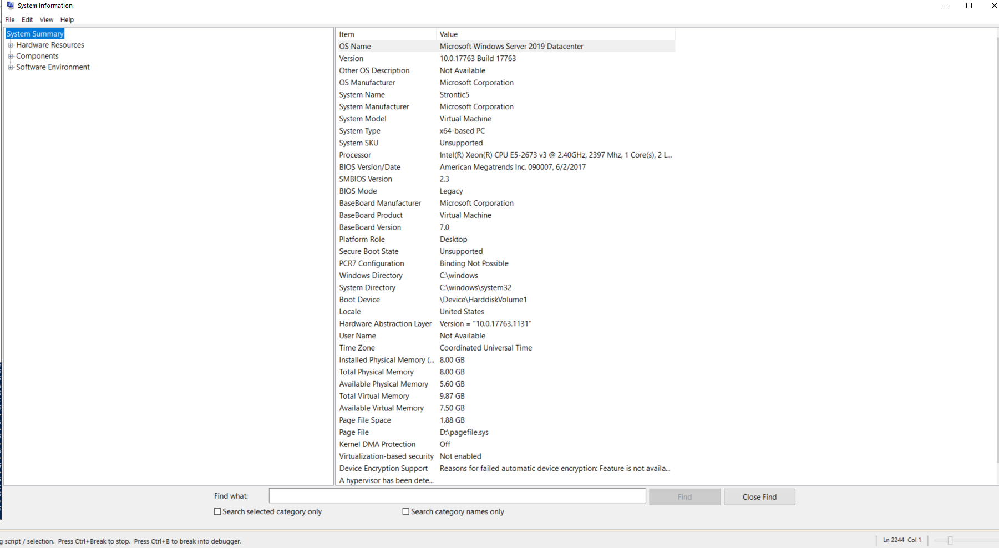

---
title: msinfo32.exe | System Information
excerpt: What is msinfo32.exe?
---

# msinfo32.exe 

* File Path: `C:\Windows\system32\msinfo32.exe`
* Description: System Information

## Screenshot



## Hashes

Type | Hash
-- | --
MD5 | `0AED91DA63713BF9F881B03A604A1C9D`
SHA1 | `B1B2D292CB1A4C13DC243B5EAB13AFB316A28B9A`
SHA256 | `5CF1604D2473661266E08FC0E4E144EA98F99B7584C43585EB2B01551130FD14`
SHA384 | `AA9283187E6467E43459D4B3ED9A70995838DBB7592883AA28C6F1AAD46249583C203A0D7C2B961F83C9F8F983F2E288`
SHA512 | `04BCA9B321D702122B6E72C2AD15B7CD98924E5DFC3B8DD0E907EA28FD7826D3F72B98C67242B6698594DF648D3C2B6B0952BB52A2363B687BBE44A66E830C03`
SSDEEP | `6144:nSR5sq8azDDjvd1i91CR4PnU1u31u2cra5LGZEOHHrpm1XUZLxEZEOHHrpm1XUZ1:nSR5sqbPd1imR4nIuFqyKtLpm1EwtLpr`
IMP | `6E6A036BD2DEF1FB34D19979D5B23ECB`
PESHA1 | `9AD90861D9B34A8F7E375D2E761C15D7F2D8F574`
PE256 | `443AEFC0548F7D6A1CE407D06258F435C0F6A14919A87160456CC177290E7991`

## Runtime Data

### Window Title:
System Information

### Open Handles:

Path | Type
-- | --
(R-D)   C:\Windows\Fonts\StaticCache.dat | File
(R-D)   C:\Windows\System32\en-US\MFC42u.dll.mui | File
(R-D)   C:\Windows\System32\en-US\msinfo32.exe.mui | File
(R-D)   C:\Windows\System32\en-US\propsys.dll.mui | File
(R-D)   C:\Windows\System32\en-US\user32.dll.mui | File
(R-D)   C:\Windows\System32\en-US\winnlsres.dll.mui | File
(RW-)   C:\Users\user | File
(RW-)   C:\Windows\WinSxS\amd64_microsoft.windows.common-controls_6595b64144ccf1df_6.0.19041.1110_none_60b5254171f9507e | File
\BaseNamedObjects\__ComCatalogCache__ | Section
\BaseNamedObjects\C:\*ProgramData\*Microsoft\*Windows\*Caches\*{6AF0698E-D558-4F6E-9B3C-3716689AF493}.2.ver0x0000000000000002.db | Section
\BaseNamedObjects\C:\*ProgramData\*Microsoft\*Windows\*Caches\*{DDF571F2-BE98-426D-8288-1A9A39C3FDA2}.2.ver0x0000000000000002.db | Section
\BaseNamedObjects\C:\*ProgramData\*Microsoft\*Windows\*Caches\*cversions.2 | Section
\BaseNamedObjects\NLS_CodePage_1252_3_2_0_0 | Section
\BaseNamedObjects\NLS_CodePage_437_3_2_0_0 | Section
\Sessions\1\Windows\Theme449731986 | Section
\Windows\Theme1396518710 | Section


### Loaded Modules:

Path |
-- |
C:\Windows\System32\ADVAPI32.dll |
C:\Windows\System32\GDI32.dll |
C:\Windows\System32\gdi32full.dll |
C:\Windows\System32\KERNEL32.DLL |
C:\Windows\System32\KERNELBASE.dll |
C:\Windows\system32\msinfo32.exe |
C:\Windows\System32\msvcp_win.dll |
C:\Windows\System32\msvcrt.dll |
C:\Windows\SYSTEM32\ntdll.dll |
C:\Windows\System32\RPCRT4.dll |
C:\Windows\System32\sechost.dll |
C:\Windows\System32\ucrtbase.dll |
C:\Windows\System32\USER32.dll |
C:\Windows\System32\win32u.dll |


## Signature

* Status: Signature verified.
* Serial: `33000002EC6579AD1E670890130000000002EC`
* Thumbprint: `F7C2F2C96A328C13CDA8CDB57B715BDEA2CBD1D9`
* Issuer: CN=Microsoft Windows Production PCA 2011, O=Microsoft Corporation, L=Redmond, S=Washington, C=US
* Subject: CN=Microsoft Windows, O=Microsoft Corporation, L=Redmond, S=Washington, C=US

## File Metadata

* Original Filename: msinfo.dll.mui
* Product Name: Microsoft Windows Operating System
* Company Name: Microsoft Corporation
* File Version: 10.0.19041.1 (WinBuild.160101.0800)
* Product Version: 10.0.19041.1
* Language: English (United States)
* Legal Copyright:  Microsoft Corporation. All rights reserved.
* Machine Type: 64-bit

## File Scan

* VirusTotal Detections: 0/73
* VirusTotal Link: https://www.virustotal.com/gui/file/5cf1604d2473661266e08fc0e4e144ea98f99b7584c43585eb2b01551130fd14/detection

## File Similarity (ssdeep match)

File | Score
-- | --
[C:\Program Files (x86)\Common Files\Microsoft Shared\MSInfo\msinfo32.exe](msinfo32.exe-5C49B7B55D4AF40DB1047E08484D6656.md) | 44
[C:\Program Files (x86)\Common Files\Microsoft Shared\MSInfo\msinfo32.exe](msinfo32.exe-E0A7B839C77497E01864479B70ACB5AE.md) | 54
[C:\Program Files (x86)\Common Files\microsoft shared\MSInfo\msinfo32.exe](msinfo32.exe-F589A0D3F0DA328F90A2A9556EF513B5.md) | 50
[C:\Program Files\Common Files\microsoft shared\MSInfo\msinfo32.exe](msinfo32.exe-0AED91DA63713BF9F881B03A604A1C9D.md) | 100
[C:\Program Files\Common Files\microsoft shared\MSInfo\msinfo32.exe](msinfo32.exe-238137CD0CD9CC74F361BEBD0178F0E6.md) | 54
[C:\Program Files\Common Files\microsoft shared\MSInfo\msinfo32.exe](msinfo32.exe-41AA3C8C427A773B6C08460535EE8070.md) | 52
[C:\Windows\system32\msinfo32.exe](msinfo32.exe-238137CD0CD9CC74F361BEBD0178F0E6.md) | 54
[C:\Windows\system32\msinfo32.exe](msinfo32.exe-41AA3C8C427A773B6C08460535EE8070.md) | 52
[C:\windows\system32\msinfo32.exe](msinfo32.exe-4BA6D7F9032FE80308C0501E087A54F6.md) | 54
[C:\WINDOWS\system32\msinfo32.exe](msinfo32.exe-CE97FD0E2556A49965411764F086CEA8.md) | 54
[C:\Windows\system32\msinfo32.exe](msinfo32.exe-DA35587758FC9C154435FB76C7183BE4.md) | 57
[C:\Windows\SysWOW64\msinfo32.exe](msinfo32.exe-2D3773A656D92C8E4367511AD4DCDD8C.md) | 49
[C:\windows\SysWOW64\msinfo32.exe](msinfo32.exe-54E568D65C876CF31586CCE68F51DEEA.md) | 54
[C:\Windows\SysWOW64\msinfo32.exe](msinfo32.exe-5C49B7B55D4AF40DB1047E08484D6656.md) | 44
[C:\WINDOWS\SysWOW64\msinfo32.exe](msinfo32.exe-626E3EE8F3DDDA3F44E9E945C54F030D.md) | 47
[C:\Windows\SysWOW64\msinfo32.exe](msinfo32.exe-E0A7B839C77497E01864479B70ACB5AE.md) | 54
[C:\Windows\SysWOW64\msinfo32.exe](msinfo32.exe-F589A0D3F0DA328F90A2A9556EF513B5.md) | 50


## Additional Info*

**The information below is copied from [MicrosoftDocs](https://github.com/MicrosoftDocs/windowsserverdocs), which is maintained by [Microsoft](https://opensource.microsoft.com/codeofconduct/). Available under [CC BY 4.0](https://creativecommons.org/licenses/by/4.0/) license.*

---

## msinfo32

>Applies to: Windows Server 2022, Windows Server 2019, Windows Server 2016, Windows Server 2012 R2, Windows Server 2012

Opens the System Information tool to display a comprehensive view of the hardware, system components, and software environment on the local computer.

Some System Information categories contain large amounts of data. You can use the **start /wait** command to optimize reporting performance for these categories. For more information, see [System Information](/previous-versions/windows/it-pro/windows-server-2003/cc783305(v=ws.10)).

### Syntax

```
msinfo32 [/pch] [/nfo <path>] [/report <path>] [/computer <computername>] [/showcategories] [/category <categoryID>] [/categories {+<categoryID>(+<categoryID>)|+all(-<categoryID>)}]
```

#### Parameters

| Parameter | Description |
| --------- | ----------- |
| `<path>` | Specifies the file to be opened in the format *C:\Folder1\File1.xxx*, where *C* is the drive letter, *Folder1* is the folder, *File1* is the file name, and *xxx* is the file name extension.<p>This file can be an **.nfo**, **.xml**, **.txt**, or **.cab** file. |
| `<computername>` | Specifies the name of the target or local computer. This can be a UNC name, an IP address, or a full computer name. |
| `<categoryID>` | Specifies the ID of the category item. You can obtain the category ID by using **/showcategories**. |
| /pch | Displays the System History view in the System Information tool. |
| /nfo | Saves the exported file as an **.nfo** file. If the file name that is specified in *path* does not end in an **.nfo** extension, the **.nfo** extension is automatically appended to the file name. |
| /report | Saves the file in *path* as a text file. The file name is saved exactly as it appears in *path*. The .txt extension is not appended to the file unless it is specified in path. |
| /computer | Starts the System Information tool for the specified remote computer. You must have the appropriate permissions to access the remote computer. |
| /showcategories | Starts the System Information tool with all available category IDs displayed, rather than displaying the friendly or localized names. For example, the Software Environment category is displayed as the **SWEnv** category. |
| /category | Starts System Information with the specified category selected. Use **/showcategories** to display a list of available category IDs. |
| /categories | Starts System Information with only the specified category or categories displayed. It also limits the output to the selected category or categories. Use **/showcategories** to display a list of available category IDs. |
| /? | Displays help at the command prompt. |

#### Examples

To list the available category IDs, type:

```
msinfo32 /showcategories
```

To start the System Information tool with all available information displayed, except Loaded Modules, type:

```
msinfo32 /categories +all -loadedmodules
```

To display **System Summary** information and to create an .nfo file called *syssum.nfo*, which contains information in the **System Summary** category, type:

```
msinfo32 /nfo syssum.nfo /categories +systemsummary
```

To display resource conflict information and to create an .nfo file called *conflicts.nfo*, which contains information about resource conflicts, type:

```
msinfo32 /nfo conflicts.nfo /categories +componentsproblemdevices+resourcesconflicts+resourcesforcedhardware
```

### Additional References

- [Command-Line Syntax Key](https://github.com/MicrosoftDocs/windowsserverdocs/tree/master/WindowsServerDocs/administration/windows-commands/command-line-syntax-key.md)

---


MIT License. Copyright (c) 2020-2021 Strontic.


