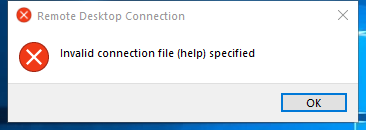

---
title: mstsc.exe | Remote Desktop Connection
excerpt: What is mstsc.exe?
---

# mstsc.exe 

* File Path: `C:\WINDOWS\SysWOW64\mstsc.exe`
* Description: Remote Desktop Connection

## Screenshot




## Hashes

Type | Hash
-- | --
MD5 | `AA3D18E908E02D4EB1D1A17E7FCF743F`
SHA1 | `9D3014000BDD86008FDC287FFF9859655D18A1D2`
SHA256 | `F7B09D5E38ED32001F198229F45C351E1B9821016BEA0D6F32297BB7FC112D66`
SHA384 | `1F538E37703D17D79D4FDEC8C41CED05CD426FB02165FE90E40AEA8964B308111C342FBB1625A407EBB764C39C16F893`
SHA512 | `316B9FFD101A919259520922715A711E9A59B0A334DAF1656E29E58E2ACE3463EFB4871620999E3522E4F5C6DC3AC2037CE01C95F06244433DAA7B37AD6CEF69`
SSDEEP | `24576:A0qQEysb0y9eYbXAD34p6tf0KRwQ1KdVlMMd6qpLch6fwmSj3r7mBvZ:ZplWpSj19sp6vm/`
IMP | `4D520B20C97C230BADB07B8D101D3E5C`
PESHA1 | `56B2A9DBEA2C87F7245E0846C20BD94BC61B08E2`
PE256 | `7C7EA8505C8B0ADF059D02847D43BDACB0C365D7E70756D81F4BABC53425BBD4`

## Signature

* Status: Signature verified.
* Serial: `33000002ED2C45E4C145CF48440000000002ED`
* Thumbprint: `312860D2047EB81F8F58C29FF19ECDB4C634CF6A`
* Issuer: CN=Microsoft Windows Production PCA 2011, O=Microsoft Corporation, L=Redmond, S=Washington, C=US
* Subject: CN=Microsoft Windows, O=Microsoft Corporation, L=Redmond, S=Washington, C=US

## File Metadata

* Original Filename: mstsc.exe
* Product Name: Microsoft Windows Operating System
* Company Name: Microsoft Corporation
* File Version: 10.0.22000.282 (WinBuild.160101.0800)
* Product Version: 10.0.22000.282
* Language: English (United States)
* Legal Copyright:  Microsoft Corporation. All rights reserved.
* Machine Type: 32-bit

## File Scan

* VirusTotal Detections: Unknown


## Possible Misuse

*The following table contains possible examples of `mstsc.exe` being misused. While `mstsc.exe` is **not** inherently malicious, its legitimate functionality can be abused for malicious purposes.*

Source | Source File | Example | License
-- | -- | -- | --
[sigma](https://github.com/Neo23x0/sigma) | [sysmon_tsclient_filewrite_startup.yml](https://github.com/Neo23x0/sigma/blob/master/rules/windows/file_event/sysmon_tsclient_filewrite_startup.yml) | `Image\|endswith: '\mstsc.exe'`{:.highlight .language-yaml} | [DRL 1.0](https://github.com/Neo23x0/sigma/blob/master/LICENSE.Detection.Rules.md)
[sigma](https://github.com/Neo23x0/sigma) | [sysmon_susp_rdp.yml](https://github.com/Neo23x0/sigma/blob/master/rules/windows/network_connection/sysmon_susp_rdp.yml) | `- '\mstsc.exe'`{:.highlight .language-yaml} | [DRL 1.0](https://github.com/Neo23x0/sigma/blob/master/LICENSE.Detection.Rules.md)
[sigma](https://github.com/Neo23x0/sigma) | [win_rdp_hijack_shadowing.yml](https://github.com/Neo23x0/sigma/blob/master/rules/windows/process_creation/win_rdp_hijack_shadowing.yml) | `title: MSTSC Shadowing`{:.highlight .language-yaml} | [DRL 1.0](https://github.com/Neo23x0/sigma/blob/master/LICENSE.Detection.Rules.md)
[sigma](https://github.com/Neo23x0/sigma) | [win_rdp_hijack_shadowing.yml](https://github.com/Neo23x0/sigma/blob/master/rules/windows/process_creation/win_rdp_hijack_shadowing.yml) | `description: Detects RDP session hijacking by using MSTSC shadowing`{:.highlight .language-yaml} | [DRL 1.0](https://github.com/Neo23x0/sigma/blob/master/LICENSE.Detection.Rules.md)
[sigma](https://github.com/Neo23x0/sigma) | [registry_event_mstsc_history_cleared.yml](https://github.com/Neo23x0/sigma/blob/master/rules/windows/registry_event/registry_event_mstsc_history_cleared.yml) | `description: Detects the deletion of registry keys containing the MSTSC connection history`{:.highlight .language-yaml} | [DRL 1.0](https://github.com/Neo23x0/sigma/blob/master/LICENSE.Detection.Rules.md)
[atomic-red-team](https://github.com/redcanaryco/atomic-red-team) | [T1021.001.md](https://github.com/redcanaryco/atomic-red-team/blob/master/atomics/T1021.001/T1021.001.md) | mstsc /v:$Server | [MIT License. © 2018 Red Canary](https://github.com/redcanaryco/atomic-red-team/blob/master/LICENSE.txt)
[atomic-red-team](https://github.com/redcanaryco/atomic-red-team) | [T1021.001.md](https://github.com/redcanaryco/atomic-red-team/blob/master/atomics/T1021.001/T1021.001.md) | $p=Tasklist /svc /fi "IMAGENAME eq mstsc.exe" /fo csv \| convertfrom-csv | [MIT License. © 2018 Red Canary](https://github.com/redcanaryco/atomic-red-team/blob/master/LICENSE.txt)
[signature-base](https://github.com/Neo23x0/signature-base) | [cn_pentestset_tools.yar](https://github.com/Neo23x0/signature-base/blob/master/yara/cn_pentestset_tools.yar) | $s1 = "srv\\newclient\\lib\\win32\\obj\\i386\\mstsc.pdb" fullword ascii | [CC BY-NC 4.0](https://github.com/Neo23x0/signature-base/blob/master/LICENSE)
[signature-base](https://github.com/Neo23x0/signature-base) | [crime_cn_campaign_njrat.yar](https://github.com/Neo23x0/signature-base/blob/master/yara/crime_cn_campaign_njrat.yar) | $a2 = "taskkill /f /im mstsc.exe" fullword ascii | [CC BY-NC 4.0](https://github.com/Neo23x0/signature-base/blob/master/LICENSE)

## Additional Info*

**The information below is copied from [MicrosoftDocs](https://github.com/MicrosoftDocs/windowsserverdocs), which is maintained by [Microsoft](https://opensource.microsoft.com/codeofconduct/). Available under [CC BY 4.0](https://creativecommons.org/licenses/by/4.0/) license.*

---

## mstsc

>Applies to: Windows Server 2022, Windows Server 2019, Windows Server 2016, Windows Server 2012 R2, Windows Server 2012

Creates connections to Remote Desktop Session Host servers or other remote computers, edits an existing Remote Desktop Connection (.rdp) configuration file, and migrates legacy connection files that were created with Client Connection Manager to new .rdp connection files.

### Syntax

```
mstsc.exe [<connectionfile>] [/v:<server>[:<port>]] [/admin] [/f] [/w:<width> /h:<height>] [/public] [/span]
mstsc.exe /edit <connectionfile>
mstsc.exe /migrate
```

#### Parameters

| Parameter | Description |
| --------- | ------------|
| `<connectionfile>` | Specifies the name of an .rdp file for the connection. |
| /v:`<server>[:<port>]` | Specifies the remote computer and, optionally, the port number to which you want to connect. |
| /admin | Connects you to a session for administering the server. |
| /f | Starts Remote Desktop Connection in full-screen mode. |
| /w:`<width>` | Specifies the width of the Remote Desktop window. |
| /h:`<height>` | Specifies the height of the Remote Desktop window. |
| /public | Runs Remote Desktop in public mode. In public mode, passwords and bitmaps aren't cached. |
| /span | Matches the Remote Desktop width and height with the local virtual desktop, spanning across multiple monitors if necessary. |
| /edit `<connectionfile>` | Opens the specified .rdp file for editing. |
| /migrate | Migrates legacy connection files that were created with Client Connection Manager to new .rdp connection files. |
| /? | Displays help at the command prompt. |

##### Remarks

- Default.rdp is stored for each user as a hidden file in the user's **Documents** folder.

- User created .rdp files are saved by default in the user's **Documents** folder, but can be saved anywhere.

- To span across monitors, the monitors must use the same resolution and must be aligned horizontally (that is, side-by-side). There is currently no support for spanning multiple monitors vertically on the client system.

#### Examples

To connect to a session in full-screen mode, type:

```
mstsc /f
```
or
```
mstsc /v:computer1 /f
```
To assign width/height, type:

```
mstsc /v:computer1 /w:1920 /h:1080
```
To open a file called *filename.rdp* for editing, type:

```
mstsc /edit filename.rdp
```

### Additional References

- [Command-Line Syntax Key](https://github.com/MicrosoftDocs/windowsserverdocs/tree/master/WindowsServerDocs/administration/windows-commands/command-line-syntax-key.md)

---


MIT License. Copyright (c) 2020-2021 Strontic.


