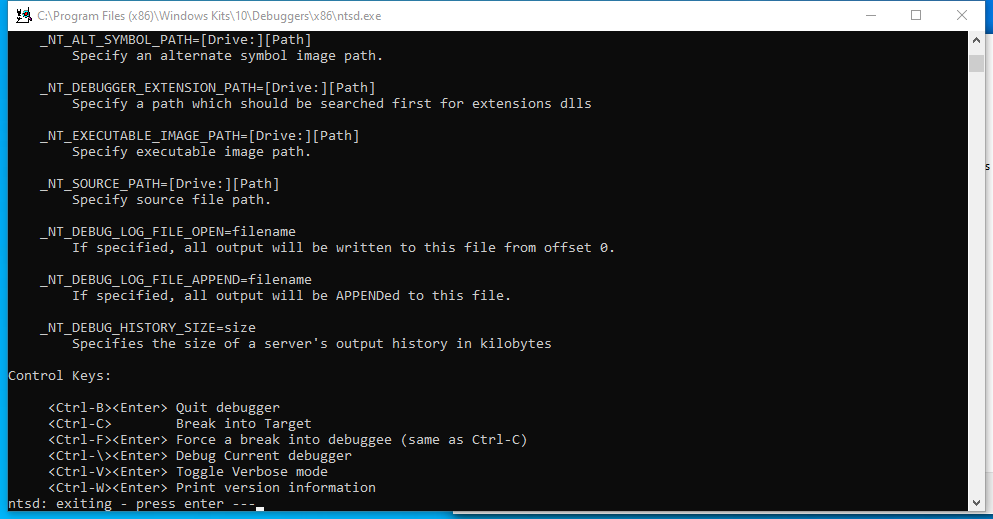

---
title: ntsd.exe | Symbolic Debugger for Windows
excerpt: What is ntsd.exe?
---

# ntsd.exe 

* File Path: `C:\Program Files (x86)\Windows Kits\10\Debuggers\x86\ntsd.exe`
* Description: Symbolic Debugger for Windows

## Screenshot

## Hashes

Type | Hash
-- | --
MD5 | `329FBD3549A7D0FB1BF3A250ED8BDFB7`
SHA1 | `6222D8D40CBC2674453CF3836BAA3D019F27C3D8`
SHA256 | `71227C3FE96B7582111BDC4FC4C098228CA6C6C4F97CDEC9AFF4FC52C352E5D9`
SHA384 | `62AB31AEA6DB71C07DDFB265166849E4C70064C838935451A5510BDB19383BA063479429752A25F872CBA02065D9C26F`
SHA512 | `B4B84F807DCFC8243B3E42DFF2C44A6FA18AEA463AC804A842C024F7F28B6CDE6BB6A309BE3A7A985EBB820CA5ABCDFBFDBF26B16596C98DF2759BA91868D331`
SSDEEP | `3072:W4+JhFnbMpmoWATuaMGhIwQ2gyq+0xovBnlYl:W4IMq+0x41lYl`
IMP | `391B93A5B608F9F327CC4452AD7F11FF`
PESHA1 | `D717A276C6FAF7308D25075120050B7473554CCE`
PE256 | `C9F5CA18763138981F234B759ABF9FA1B9197B87CA5B24065E3040477AFA9FE8`

## Runtime Data

### Child Processes:
conhost.exe

### Window Title:
C:\Program Files (x86)\Windows Kits\10\Debuggers\x86\ntsd.exe

### Open Handles:

Path | Type
-- | --
(R-D)   C:\Program Files (x86)\Windows Kits\10\Debuggers\x86\sym\wntdll.pdb\3CCC2398F623C3D0915D0E0ADC5714A71\wntdll.pdb | File
(RW-)   C:\Users\user | File
(RW-)   C:\Windows | File
(RWD)   C:\Windows\SysWOW64\ntdll.dll | File
\BaseNamedObjects\C:\*ProgramData\*Microsoft\*Windows\*Caches\*{6AF0698E-D558-4F6E-9B3C-3716689AF493}.2.ver0x0000000000000002.db | Section
\BaseNamedObjects\C:\*ProgramData\*Microsoft\*Windows\*Caches\*{DDF571F2-BE98-426D-8288-1A9A39C3FDA2}.2.ver0x0000000000000002.db | Section
\BaseNamedObjects\C:\*ProgramData\*Microsoft\*Windows\*Caches\*cversions.2 | Section
\BaseNamedObjects\NLS_CodePage_1252_3_2_0_0 | Section
\BaseNamedObjects\NLS_CodePage_437_3_2_0_0 | Section

### Loaded Modules:

Path |
-- |
C:\Program Files (x86)\Windows Kits\10\Debuggers\x86\ntsd.exe |
C:\Windows\SYSTEM32\ntdll.dll |
C:\Windows\System32\wow64.dll |
C:\Windows\System32\wow64cpu.dll |
C:\Windows\System32\wow64win.dll |

## Signature

* Status: Signature verified.
* Serial: `33000002CF6D2CC57CAA65A6D80000000002CF`
* Thumbprint: `1A221B3B4FEF088B17BA6704FD088DF192D9E0EF`
* Issuer: CN=Microsoft Code Signing PCA 2010, O=Microsoft Corporation, L=Redmond, S=Washington, C=US
* Subject: CN=Microsoft Corporation, O=Microsoft Corporation, L=Redmond, S=Washington, C=US

## File Metadata

* Original Filename: NTSD.Exe
* Product Name: Microsoft Windows Operating System
* Company Name: Microsoft Corporation
* File Version: 10.0.19041.1 (WinBuild.160101.0800)
* Product Version: 10.0.19041.1
* Language: English (United States)
* Legal Copyright:  Microsoft Corporation. All rights reserved.
* Machine Type: 32-bit

## File Scan

* VirusTotal Detections: 1/76
* VirusTotal Link: https://www.virustotal.com/gui/file/71227c3fe96b7582111bdc4fc4c098228ca6c6c4f97cdec9aff4fc52c352e5d9/detection

## File Similarity (ssdeep match)

File | Score
-- | --
[C:\Program Files (x86)\Windows Kits\10\Debuggers\arm\cdb.exe](cdb.exe-5017F8EFBE98513AEB75EAC57C1EA351.md) | 38
[C:\Program Files (x86)\Windows Kits\10\Debuggers\arm\kd.exe](kd.exe-F6B9E69A6C0563D9338B4B73EBAAC34C.md) | 40
[C:\Program Files (x86)\Windows Kits\10\Debuggers\arm\ntkd.exe](ntkd.exe-F468EEBF04739821C2B5C322754FA720.md) | 36
[C:\Program Files (x86)\Windows Kits\10\Debuggers\arm\ntsd.exe](ntsd.exe-629EA12D527237B9CD945AC44C2DE80D.md) | 44
[C:\Program Files (x86)\Windows Kits\10\Debuggers\x86\cdb.exe](cdb.exe-6E953EFEB12896AC0EC17D198902FAE1.md) | 50
[C:\Program Files (x86)\Windows Kits\10\Debuggers\x86\kd.exe](kd.exe-E61F51C4CF00EFABF19CC6E80A128846.md) | 46
[C:\Program Files (x86)\Windows Kits\10\Debuggers\x86\ntkd.exe](ntkd.exe-BCABCBB87A2D6CF497D3FBF60BDD2543.md) | 44

## Possible Misuse

*The following table contains possible examples of `ntsd.exe` being misused. While `ntsd.exe` is **not** inherently malicious, its legitimate functionality can be abused for malicious purposes.*

Source | Source File | Example | License
-- | -- | -- | --
[atomic-red-team](https://github.com/redcanaryco/atomic-red-team) | [T1546.012.md](https://github.com/redcanaryco/atomic-red-team/blob/master/atomics/T1546.012/T1546.012.md) | <blockquote>Adversaries may establish persistence and/or elevate privileges by executing malicious content triggered by Image File Execution Options (IFEO) debuggers. IFEOs enable a developer to attach a debugger to an application. When a process is created, a debugger present in an application’s IFEO will be prepended to the application’s name, effectively launching the new process under the debugger (e.g., <code>C:\dbg\ntsd.exe -g  notepad.exe</code>). (Citation: Microsoft Dev Blog IFEO Mar 2010) | [MIT License. © 2018 Red Canary](https://github.com/redcanaryco/atomic-red-team/blob/master/LICENSE.txt)

MIT License. Copyright (c) 2020-2021 Strontic.

