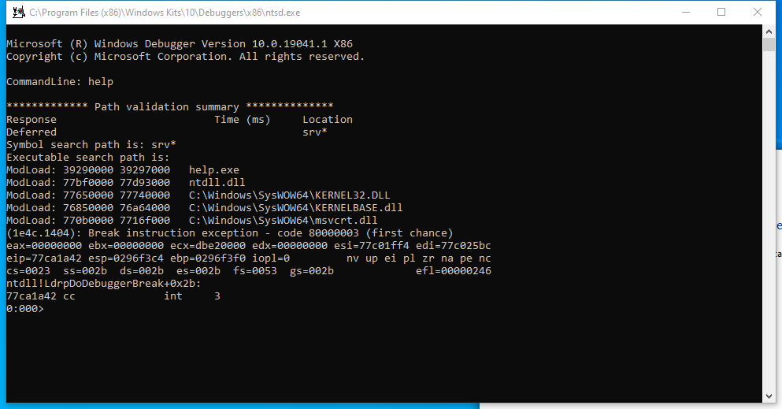
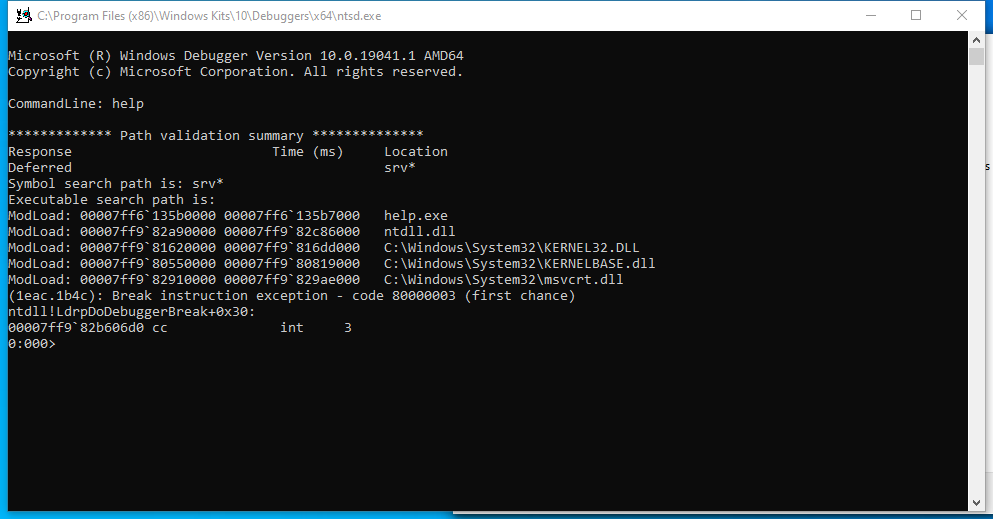

---
title: ntsd.exe | Symbolic Debugger for Windows
excerpt: What is ntsd.exe?
---

# ntsd.exe 

* File Path: `C:\Program Files (x86)\Windows Kits\10\Debuggers\arm\ntsd.exe`
* Description: Symbolic Debugger for Windows

## Screenshot

## Hashes

Type | Hash
-- | --
MD5 | `629EA12D527237B9CD945AC44C2DE80D`
SHA1 | `DABB109A73FCBCAD223B1B745E470689811BDABE`
SHA256 | `A989E057B11D4B4DD3737CD0091C8060552959E98C8B4958A58A3E68EB5D9BE1`
SHA384 | `7049A36AE2C131E7D99DAB6B5CBB6EEC3E719225CD5915AE3D183268C3CB7838EF9397904134B295DD18FE734AD59B87`
SHA512 | `812529E1FD4F8AC7A5EBC88B548F32103F1A6A5BA9E6DFB62E6F7F028881B917E537E7136313C6E0618E11DE91F0A4783578BBE7C7E0F66C3CA2096BEDAD3C64`
SSDEEP | `3072:oH+JhFnbMpmoWATuaRFOarqdu4Eyj4c9pkp5/BHhR9x:oHjMamdu4Ew9pkp5/3d`
IMP | `F63FEB3A70D730CEF82DBC8F5675167C`
PESHA1 | `1F02DECBDE9FF7085E7E6807E1B9B824AC4DC630`
PE256 | `459D91763A8D1D70C54FE0541598B6D7436EBA725B220FE4C127A8D94F4CA75B`

## Signature

* Status: Signature verified.
* Serial: `33000002B7E8E007A82AEF13150000000002B7`
* Thumbprint: `5A68625F1A516670A744F7EF919500A479D32A5B`
* Issuer: CN=Microsoft Code Signing PCA 2010, O=Microsoft Corporation, L=Redmond, S=Washington, C=US
* Subject: CN=Microsoft Windows Kits Publisher, O=Microsoft Corporation, L=Redmond, S=Washington, C=US

## File Metadata

* Original Filename: NTSD.Exe
* Product Name: Microsoft Windows Operating System
* Company Name: Microsoft Corporation
* File Version: 10.0.19041.1 (WinBuild.160101.0800)
* Product Version: 10.0.19041.1
* Language: English (United States)
* Legal Copyright:  Microsoft Corporation. All rights reserved.
* Machine Type: 452

## File Scan

* VirusTotal Detections: Unknown
* VirusTotal Link: n/a

## File Similarity (ssdeep match)

File | Score
-- | --
[C:\Program Files (x86)\Windows Kits\10\Debuggers\arm\cdb.exe](cdb.exe-5017F8EFBE98513AEB75EAC57C1EA351.md) | 43
[C:\Program Files (x86)\Windows Kits\10\Debuggers\arm\kd.exe](kd.exe-F6B9E69A6C0563D9338B4B73EBAAC34C.md) | 38
[C:\Program Files (x86)\Windows Kits\10\Debuggers\arm\ntkd.exe](ntkd.exe-F468EEBF04739821C2B5C322754FA720.md) | 41
[C:\Program Files (x86)\Windows Kits\10\Debuggers\x86\cdb.exe](cdb.exe-6E953EFEB12896AC0EC17D198902FAE1.md) | 38
[C:\Program Files (x86)\Windows Kits\10\Debuggers\x86\kd.exe](kd.exe-E61F51C4CF00EFABF19CC6E80A128846.md) | 36
[C:\Program Files (x86)\Windows Kits\10\Debuggers\x86\ntkd.exe](ntkd.exe-BCABCBB87A2D6CF497D3FBF60BDD2543.md) | 41
[C:\Program Files (x86)\Windows Kits\10\Debuggers\x86\ntsd.exe](ntsd.exe-329FBD3549A7D0FB1BF3A250ED8BDFB7.md) | 44

## Possible Misuse

*The following table contains possible examples of `ntsd.exe` being misused. While `ntsd.exe` is **not** inherently malicious, its legitimate functionality can be abused for malicious purposes.*

Source | Source File | Example | License
-- | -- | -- | --
[atomic-red-team](https://github.com/redcanaryco/atomic-red-team) | [T1546.012.md](https://github.com/redcanaryco/atomic-red-team/blob/master/atomics/T1546.012/T1546.012.md) | <blockquote>Adversaries may establish persistence and/or elevate privileges by executing malicious content triggered by Image File Execution Options (IFEO) debuggers. IFEOs enable a developer to attach a debugger to an application. When a process is created, a debugger present in an application’s IFEO will be prepended to the application’s name, effectively launching the new process under the debugger (e.g., <code>C:\dbg\ntsd.exe -g  notepad.exe</code>). (Citation: Microsoft Dev Blog IFEO Mar 2010) | [MIT License. © 2018 Red Canary](https://github.com/redcanaryco/atomic-red-team/blob/master/LICENSE.txt)

MIT License. Copyright (c) 2020 Strontic.

