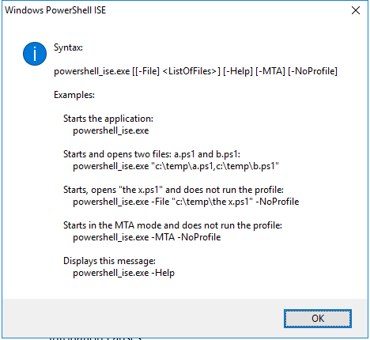

---
title: powershell_ise.exe | Windows PowerShell ISE
excerpt: What is powershell_ise.exe?
---

# powershell_ise.exe 

* File Path: `C:\Windows\SysWOW64\WindowsPowerShell\v1.0\powershell_ise.exe`
* Description: Windows PowerShell ISE

## Screenshot



## Hashes

Type | Hash
-- | --
MD5 | `0722BC6EA7EB1A21AC2FAC7BE9B4C9A6`
SHA1 | `433001D7173D18F5B294CC2B6F5F1FB411843764`
SHA256 | `92A89AE883ED67889C50FA7AF84B1A94768C7A257DAA263211616D745D8DBDC3`
SHA384 | `5D90625927DB70C74525971AC1AFC2EBAC2E2CF97D004397DFDCAB856758F5AB527627EDE455E2EABAD872EE08B3C842`
SHA512 | `684EEC347F39D9135E856A827D6410C545CFB6E0F10A34E93785E975C958192C700B991A23A78817FBFDA14B4CD8FA2488D4F304B110CD3F46A22D1680E2B7C5`
SSDEEP | `3072:o9kVjGPsw40xLkVjqP4w6U+ToIuWNXmmZTWl/jC7gDooMLdx:0kauZToIuUXmmZbgDooMb`
IMP | `F34D5F2D4577ED6D9CEEC516C1F5A744`
PESHA1 | `BF6BDEDA271A79E842CFF22C14536992BBBC28F9`
PE256 | `45C77CCBCE87AD3A7B87755E83E8947C7FF08701C239076BCC0336198EB790C8`

## Runtime Data

### Window Title:
Windows PowerShell ISE

### Open Handles:

Path | Type
-- | --
(R-D)   C:\Windows\Fonts\StaticCache.dat | File
(R-D)   C:\Windows\Microsoft.NET\assembly\GAC_32\mscorlib\v4.0_4.0.0.0__b77a5c561934e089\mscorlib.dll | File
(R-D)   C:\Windows\Microsoft.NET\assembly\GAC_MSIL\Microsoft.PowerShell.ISECommon\v4.0_3.0.0.0__31bf3856ad364e35\Microsoft.PowerShell.ISECommon.dll | File
(R-D)   C:\Windows\Microsoft.NET\assembly\GAC_MSIL\System.Core\v4.0_4.0.0.0__b77a5c561934e089\System.Core.dll | File
(R-D)   C:\Windows\Microsoft.NET\assembly\GAC_MSIL\System.Drawing\v4.0_4.0.0.0__b03f5f7f11d50a3a\System.Drawing.dll | File
(R-D)   C:\Windows\Microsoft.NET\assembly\GAC_MSIL\System.Management.Automation\v4.0_3.0.0.0__31bf3856ad364e35\System.Management.Automation.dll | File
(R-D)   C:\Windows\Microsoft.NET\assembly\GAC_MSIL\System.Windows.Forms\v4.0_4.0.0.0__b77a5c561934e089\System.Windows.Forms.dll | File
(R-D)   C:\Windows\Microsoft.NET\assembly\GAC_MSIL\System\v4.0_4.0.0.0__b77a5c561934e089\System.dll | File
(R-D)   C:\Windows\System32\en-US\winnlsres.dll.mui | File
(R-D)   C:\Windows\SystemResources\imageres.dll.mun | File
(RW-)   C:\Users\user | File
(RW-)   C:\Windows | File
(RW-)   C:\Windows\WinSxS\x86_microsoft.windows.common-controls_6595b64144ccf1df_6.0.19041.488_none_11b1e5df2ffd8627 | File
\...\Cor_SxSPublic_IPCBlock | Section
\BaseNamedObjects\C:\*ProgramData\*Microsoft\*Windows\*Caches\*{6AF0698E-D558-4F6E-9B3C-3716689AF493}.2.ver0x0000000000000002.db | Section
\BaseNamedObjects\C:\*ProgramData\*Microsoft\*Windows\*Caches\*{DDF571F2-BE98-426D-8288-1A9A39C3FDA2}.2.ver0x0000000000000002.db | Section
\BaseNamedObjects\C:\*ProgramData\*Microsoft\*Windows\*Caches\*cversions.2 | Section
\BaseNamedObjects\Cor_Private_IPCBlock_v4_948 | Section
\BaseNamedObjects\NLS_CodePage_1252_3_2_0_0 | Section
\BaseNamedObjects\NLS_CodePage_437_3_2_0_0 | Section
\Sessions\1\Windows\Theme1175649999 | Section
\Windows\Theme601709542 | Section


### Loaded Modules:

Path |
-- |
C:\Windows\SYSTEM32\ntdll.dll |
C:\Windows\System32\wow64.dll |
C:\Windows\System32\wow64cpu.dll |
C:\Windows\System32\wow64win.dll |
C:\Windows\SysWOW64\WindowsPowerShell\v1.0\powershell_ise.exe |


## Signature

* Status: Signature verified.
* Serial: `330000023241FB59996DCC4DFF000000000232`
* Thumbprint: `FF82BC38E1DA5E596DF374C53E3617F7EDA36B06`
* Issuer: CN=Microsoft Windows Production PCA 2011, O=Microsoft Corporation, L=Redmond, S=Washington, C=US
* Subject: CN=Microsoft Windows, O=Microsoft Corporation, L=Redmond, S=Washington, C=US

## File Metadata

* Original Filename: powershell_ise.EXE
* Product Name: Microsoft Windows Operating System
* Company Name: Microsoft Corporation
* File Version: 10.0.19041.1 (WinBuild.160101.0800)
* Product Version: 10.0.19041.1
* Language: English (United States)
* Legal Copyright:  Microsoft Corporation. All rights reserved.
* Machine Type: 32-bit

## File Scan

* VirusTotal Detections: 0/75
* VirusTotal Link: https://www.virustotal.com/gui/file/92a89ae883ed67889c50fa7af84b1a94768c7a257daa263211616d745d8dbdc3/detection

## File Similarity (ssdeep match)

File | Score
-- | --
[C:\WINDOWS\system32\WindowsPowerShell\v1.0\powershell_ise.exe](powershell_ise.exe-2A02490E8930ACC10F135F86F7A4BAE9.md) | 93
[C:\WINDOWS\system32\WindowsPowerShell\v1.0\powershell_ise.exe](powershell_ise.exe-30A2792A2428CD06CFEC23ECB074889A.md) | 93
[C:\Windows\system32\WindowsPowerShell\v1.0\powershell_ise.exe](powershell_ise.exe-3F06E220C3E591F458D549B01ECCCB95.md) | 88
[C:\Windows\system32\WindowsPowerShell\v1.0\powershell_ise.exe](powershell_ise.exe-9577A63626D2536E7416494F09F0EEC2.md) | 90
[C:\Windows\system32\WindowsPowerShell\v1.0\powershell_ise.exe](powershell_ise.exe-E05920670516CC96822699E5688A79FA.md) | 94
[C:\Windows\SysWOW64\WindowsPowerShell\v1.0\powershell_ise.exe](powershell_ise.exe-83B61B8AE3AE5CA669E1CBB191B4852D.md) | 90
[C:\Windows\SysWOW64\WindowsPowerShell\v1.0\powershell_ise.exe](powershell_ise.exe-8F1F1C4EDA2CFA2073E82A409BBE35D0.md) | 90
[C:\WINDOWS\SysWOW64\WindowsPowerShell\v1.0\powershell_ise.exe](powershell_ise.exe-9F47663A5E104CD1EF4079CC37F12674.md) | 91
[C:\WINDOWS\SysWOW64\WindowsPowerShell\v1.0\powershell_ise.exe](powershell_ise.exe-C6F1756BFE0CBE8F9E32670748F5E833.md) | 91

## Possible Misuse

*The following table contains possible examples of `powershell_ise.exe` being misused. While `powershell_ise.exe` is **not** inherently malicious, its legitimate functionality can be abused for malicious purposes.*

Source | Source File | Example | License
-- | -- | -- | --
[sigma](https://github.com/Neo23x0/sigma) | [sysmon_in_memory_powershell.yml](https://github.com/Neo23x0/sigma/blob/master/rules/windows/image_load/sysmon_in_memory_powershell.yml) | `- '\powershell_ise.exe'`{:.highlight .language-yaml} | [DRL 1.0](https://github.com/Neo23x0/sigma/blob/master/LICENSE.Detection.Rules.md)
[sigma](https://github.com/Neo23x0/sigma) | [sysmon_alternate_powershell_hosts_pipe.yml](https://github.com/Neo23x0/sigma/blob/master/rules/windows/pipe_created/sysmon_alternate_powershell_hosts_pipe.yml) | `- '\powershell_ise.exe'`{:.highlight .language-yaml} | [DRL 1.0](https://github.com/Neo23x0/sigma/blob/master/LICENSE.Detection.Rules.md)
[sigma](https://github.com/Neo23x0/sigma) | [win_renamed_binary.yml](https://github.com/Neo23x0/sigma/blob/master/rules/windows/process_creation/win_renamed_binary.yml) | `- 'powershell_ise.exe'`{:.highlight .language-yaml} | [DRL 1.0](https://github.com/Neo23x0/sigma/blob/master/LICENSE.Detection.Rules.md)
[sigma](https://github.com/Neo23x0/sigma) | [win_renamed_binary.yml](https://github.com/Neo23x0/sigma/blob/master/rules/windows/process_creation/win_renamed_binary.yml) | `- '\powershell_ise.exe'`{:.highlight .language-yaml} | [DRL 1.0](https://github.com/Neo23x0/sigma/blob/master/LICENSE.Detection.Rules.md)
[sigma](https://github.com/Neo23x0/sigma) | [win_renamed_binary_highly_relevant.yml](https://github.com/Neo23x0/sigma/blob/master/rules/windows/process_creation/win_renamed_binary_highly_relevant.yml) | `- "powershell_ise.exe"`{:.highlight .language-yaml} | [DRL 1.0](https://github.com/Neo23x0/sigma/blob/master/LICENSE.Detection.Rules.md)
[sigma](https://github.com/Neo23x0/sigma) | [win_renamed_binary_highly_relevant.yml](https://github.com/Neo23x0/sigma/blob/master/rules/windows/process_creation/win_renamed_binary_highly_relevant.yml) | `- '\powershell_ise.exe'`{:.highlight .language-yaml} | [DRL 1.0](https://github.com/Neo23x0/sigma/blob/master/LICENSE.Detection.Rules.md)
[sigma](https://github.com/Neo23x0/sigma) | [win_renamed_powershell.yml](https://github.com/Neo23x0/sigma/blob/master/rules/windows/process_creation/win_renamed_powershell.yml) | `- '\powershell_ise.exe'`{:.highlight .language-yaml} | [DRL 1.0](https://github.com/Neo23x0/sigma/blob/master/LICENSE.Detection.Rules.md)
[sigma](https://github.com/Neo23x0/sigma) | [win_susp_bitstransfer.yml](https://github.com/Neo23x0/sigma/blob/master/rules/windows/process_creation/win_susp_bitstransfer.yml) | `- '\powershell_ise.exe'`{:.highlight .language-yaml} | [DRL 1.0](https://github.com/Neo23x0/sigma/blob/master/LICENSE.Detection.Rules.md)
[atomic-red-team](https://github.com/redcanaryco/atomic-red-team) | [T1059.001.md](https://github.com/redcanaryco/atomic-red-team/blob/master/atomics/T1059.001/T1059.001.md) | 1. Open Powershell_ise as a Privileged Account | [MIT License. © 2018 Red Canary](https://github.com/redcanaryco/atomic-red-team/blob/master/LICENSE.txt)

## Additional Info*

**The information below is copied from [MicrosoftDocs](https://github.com/MicrosoftDocs/windowsserverdocs), which is maintained by [Microsoft](https://opensource.microsoft.com/codeofconduct/). Available under [CC BY 4.0](https://creativecommons.org/licenses/by/4.0/) license.*

---

## PowerShell_ise

Windows PowerShell Integrated Scripting Environment (ISE) is a graphical host application that enables you to read, write, run, debug, and test scripts and modules in a graphic-assisted environment. Key features such as IntelliSense, Show-Command, snippets, tab completion, syntax-coloring, visual debugging, and context-sensitive Help provide a rich scripting experience.

### Using PowerShell.exe

The **PowerShell_ISE.exe** tool starts a Windows PowerShell ISE session. When you use **PowerShell_ISE.exe**, you can use its optional parameters to open files in Windows PowerShell ISE or to start a Windows PowerShell ISE session with no profile or with a multithreaded apartment.

- To start a Windows PowerShell ISE session in a Command Prompt window, in Windows PowerShell, or at the **Start** menu, type:

  ```powershell
  PowerShell_Ise.exe
  ```

- To open a script (.ps1), script module (.psm1), module manifest (.psd1), XML file, or any other supported file in Windows PowerShell ISE, type:

  ```powershell
  PowerShell_Ise.exe <filepath>
  ```

  In Windows PowerShell 3.0, you can use the optional **File** parameter as follows:

  ```powershell
  PowerShell_Ise.exe -file <filepath>
  ```

- To start a Windows PowerShell ISE session without your Windows PowerShell profiles, use the **NoProfile** parameter. (The **NoProfile** parameter is introduced in Windows PowerShell 3.0.), type:

  ```powershell
  PowerShell_Ise.exe -NoProfile
  ```

- To see the PowerShell_ISE.exe help file, type:

    ```powershell
    PowerShell_Ise.exe -help
    PowerShell_Ise.exe -?
    PowerShell_Ise.exe /?
    ```

#### Remarks

- For a complete list of the **PowerShell_ISE.exe** command-line parameters, see [about_PowerShell_Ise.Exe](/powershell/module/microsoft.powershell.core/about/about_powershell_ise_exe).

- For information about other ways to start Windows PowerShell, see [Starting Windows PowerShell](/powershell/scripting/windows-powershell/starting-windows-powershell).

- Windows PowerShell runs on the Server Core installation option of Windows Server operating systems. However, because Windows PowerShell ISE requires a graphic user interface, it does not run on Server Core installations.

### Additional References

- [about_PowerShell_Ise.exe](/powershell/module/microsoft.powershell.core/about/about_powershell_exe)

---


MIT License. Copyright (c) 2020-2021 Strontic.


