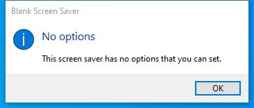

---
title: scrnsave.scr | Blank Screen Saver
excerpt: What is scrnsave.scr?
---

# scrnsave.scr 

* File Path: `C:\Windows\system32\scrnsave.scr`
* Description: Blank Screen Saver

## Screenshot

## Hashes

Type | Hash
-- | --
MD5 | `F47AC4FDECF415001CB33D1D479BB5A3`
SHA1 | `4144DA30C987366C92C67002B9D80DBA03C312C2`
SHA256 | `48624B200CB33ED2F4F545565C5E2F0993B5667D7CF7A5D20DAE0891CFD06453`
SHA384 | `68A9B70333B3F22EAAF874BBC6EC41C5B26981A97EE527A924474E9343E7BB21443FF1CDB10AE8ADFC06CC22474C6E9E`
SHA512 | `C82674F1AAF0B9BB2526A4C37EFC0C779519F080B68E9C605611DE8C6BF63AFDF8F45D6910A9CCEA582519B2BDC5D61E16AC16CDAAACB9538CCE54536C505262`
SSDEEP | `768:AfdAaPWrtZHqM1VGSxprFWwRojtyloomcrqWBcxWNUCMI/BNis4o:baPQtJ5GEpIRjwlobcrqW2kbMI/Os4o`
IMP | `749FD860D132C570D670F32D2CF9D4FE`
PESHA1 | `E1E14BA306E4F47410C3AC449A4AC5A0C0086B92`
PE256 | `F36A2DF32AC94DCCE2DD945E2064D1578E8227AF8D51299897BD2FBDE50B7480`

## Runtime Data

### Window Title:
Blank Screen Saver

### Open Handles:

Path | Type
-- | --
(R-D)   C:\Windows\Fonts\StaticCache.dat | File
(R-D)   C:\Windows\System32\en-US\duser.dll.mui | File
(R-D)   C:\Windows\System32\en-US\scrnsave.scr.mui | File
(R-D)   C:\Windows\SystemResources\imageres.dll.mun | File
(R-D)   C:\Windows\WinSxS\amd64_microsoft.windows.c..-controls.resources_6595b64144ccf1df_6.0.19041.1_en-us_cb612d02732b0fd9\comctl32.dll.mui | File
(RW-)   C:\Users\user | File
(RW-)   C:\Windows\WinSxS\amd64_microsoft.windows.c..-controls.resources_6595b64144ccf1df_6.0.19041.1_en-us_cb612d02732b0fd9 | File
(RW-)   C:\Windows\WinSxS\amd64_microsoft.windows.common-controls_6595b64144ccf1df_6.0.19041.746_none_ca02b4b61b8320a4 | File
\BaseNamedObjects\C:\*ProgramData\*Microsoft\*Windows\*Caches\*{6AF0698E-D558-4F6E-9B3C-3716689AF493}.2.ver0x0000000000000002.db | Section
\BaseNamedObjects\C:\*ProgramData\*Microsoft\*Windows\*Caches\*{DDF571F2-BE98-426D-8288-1A9A39C3FDA2}.2.ver0x0000000000000002.db | Section
\BaseNamedObjects\C:\*ProgramData\*Microsoft\*Windows\*Caches\*cversions.2 | Section
\BaseNamedObjects\NLS_CodePage_1252_3_2_0_0 | Section
\BaseNamedObjects\NLS_CodePage_437_3_2_0_0 | Section
\Sessions\1\Windows\Theme3205582532 | Section
\Windows\Theme3800351183 | Section

### Loaded Modules:

Path |
-- |
C:\Windows\System32\ADVAPI32.dll |
C:\Windows\System32\GDI32.dll |
C:\Windows\System32\gdi32full.dll |
C:\Windows\System32\KERNEL32.DLL |
C:\Windows\System32\KERNELBASE.dll |
C:\Windows\System32\msvcp_win.dll |
C:\Windows\System32\msvcrt.dll |
C:\Windows\SYSTEM32\ntdll.dll |
C:\Windows\System32\RPCRT4.dll |
C:\Windows\system32\scrnsave.scr |
C:\Windows\System32\sechost.dll |
C:\Windows\System32\ucrtbase.dll |
C:\Windows\System32\win32u.dll |

## Signature

* Status: Signature verified.
* Serial: `3300000266BD1580EFA75CD6D3000000000266`
* Thumbprint: `A4341B9FD50FB9964283220A36A1EF6F6FAA7840`
* Issuer: CN=Microsoft Windows Production PCA 2011, O=Microsoft Corporation, L=Redmond, S=Washington, C=US
* Subject: CN=Microsoft Windows, O=Microsoft Corporation, L=Redmond, S=Washington, C=US

## File Metadata

* Original Filename: scrnsave
* Product Name: Microsoft Windows Operating System
* Company Name: Microsoft Corporation
* File Version: 10.0.19041.1 (WinBuild.160101.0800)
* Product Version: 10.0.19041.1
* Language: English (United States)
* Legal Copyright:  Microsoft Corporation. All rights reserved.
* Machine Type: 64-bit

## File Scan

* VirusTotal Detections: 0/76
* VirusTotal Link: https://www.virustotal.com/gui/file/48624b200cb33ed2f4f545565c5e2f0993b5667d7cf7a5d20dae0891cfd06453/detection

## Possible Misuse

*The following table contains possible examples of `scrnsave.scr` being misused. While `scrnsave.scr` is **not** inherently malicious, its legitimate functionality can be abused for malicious purposes.*

Source | Source File | Example | License
-- | -- | -- | --
[atomic-red-team](https://github.com/redcanaryco/atomic-red-team) | [T1546.002.md](https://github.com/redcanaryco/atomic-red-team/blob/master/atomics/T1546.002/T1546.002.md) | <blockquote>Adversaries may establish persistence by executing malicious content triggered by user inactivity. Screensavers are programs that execute after a configurable time of user inactivity and consist of Portable Executable (PE) files with a .scr file extension.(Citation: Wikipedia Screensaver) The Windows screensaver application scrnsave.scr is located in <code>C:\Windows\System32\</code>, and <code>C:\Windows\sysWOW64\</code>  on 64-bit Windows systems, along with screensavers included with base Windows installations. | [MIT License. © 2018 Red Canary](https://github.com/redcanaryco/atomic-red-team/blob/master/LICENSE.txt)

MIT License. Copyright (c) 2020-2021 Strontic.

