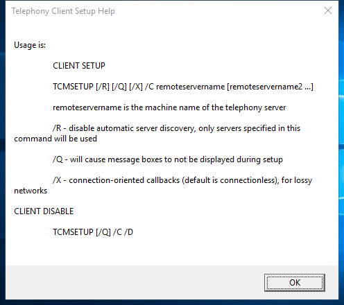

---
title: tcmsetup.exe | Microsoft Windows(TM) Telephony Administration Setup
excerpt: What is tcmsetup.exe?
---

# tcmsetup.exe 

* File Path: `C:\WINDOWS\system32\tcmsetup.exe`
* Description: Microsoft Windows(TM) Telephony Administration Setup

## Screenshot



## Hashes

Type | Hash
-- | --
MD5 | `03C7803A618A385A21CA632C792D8972`
SHA1 | `8B3F67A6E8CA7412487B02B5872D72FB055575F6`
SHA256 | `B192C79CB20AC634178F1EE45BB89B851F936601A4FC0B30241693E7135B73DC`
SHA384 | `07BF407066292A7560C0DE6C2C36436EEFCAE15F31544FA304A475D3DACF89D467358E8AB50459619BDD246C65C37EDE`
SHA512 | `9AD56D3D3305EF7DB45630E9FF779CEDFD17B80E29F91AB056717596A55BB59E968326CC0294543AFC490E55A21E2212811EC3B9D54C999D1F57EA07A876908F`
SSDEEP | `192:7VaHDvKSs7Be/zFCQ+p46Dm9/9y4SsodhOWFLmNcNWEfdABrFuWG0oW:krKSsFefYuM4UbZscNWhuWG0oW`
IMP | `AE7E4F06CC6D11D0E730DEFD22D14777`
PESHA1 | `18A92A90CE7E3B41537D728156BC39D415831E15`
PE256 | `39BD054B26B31B472D1BFC8BD5FCA1C3F63A1255FADA5CDBCEFF4213209F046D`

## Runtime Data

### Child Processes:
RdpSa.exe

### Window Title:
Telephony Client Setup Help

### Open Handles:

Path | Type
-- | --
(R-D)   C:\Windows\Fonts\StaticCache.dat | File
(R-D)   C:\Windows\System32\en-US\tcmsetup.exe.mui | File
(RW-)   C:\Windows\System32 | File
(RW-)   C:\Windows\WinSxS\amd64_microsoft.windows.common-controls_6595b64144ccf1df_6.0.22000.120_none_9d947278b86cc467 | File
\BaseNamedObjects\C:\*ProgramData\*Microsoft\*Windows\*Caches\*{6AF0698E-D558-4F6E-9B3C-3716689AF493}.2.ver0x0000000000000001.db | Section
\BaseNamedObjects\C:\*ProgramData\*Microsoft\*Windows\*Caches\*{DDF571F2-BE98-426D-8288-1A9A39C3FDA2}.2.ver0x0000000000000001.db | Section
\BaseNamedObjects\C:\*ProgramData\*Microsoft\*Windows\*Caches\*cversions.2.ro | Section
\Sessions\2\BaseNamedObjects\NLS_CodePage_1252_3_2_0_0 | Section
\Sessions\2\BaseNamedObjects\NLS_CodePage_437_3_2_0_0 | Section
\Sessions\2\Windows\Theme1077709572 | Section
\Windows\Theme3461253685 | Section


### Loaded Modules:

Path |
-- |
C:\WINDOWS\System32\ADVAPI32.dll |
C:\WINDOWS\System32\KERNEL32.DLL |
C:\WINDOWS\System32\KERNELBASE.dll |
C:\WINDOWS\SYSTEM32\ntdll.dll |
C:\WINDOWS\system32\tcmsetup.exe |


## Signature

* Status: Signature verified.
* Serial: `33000002ED2C45E4C145CF48440000000002ED`
* Thumbprint: `312860D2047EB81F8F58C29FF19ECDB4C634CF6A`
* Issuer: CN=Microsoft Windows Production PCA 2011, O=Microsoft Corporation, L=Redmond, S=Washington, C=US
* Subject: CN=Microsoft Windows, O=Microsoft Corporation, L=Redmond, S=Washington, C=US

## File Metadata

* Original Filename: TCMSETUP.EXE.MUI
* Product Name: Microsoft Windows Operating System
* Company Name: Microsoft Corporation
* File Version: 10.0.22000.1 (WinBuild.160101.0800)
* Product Version: 10.0.22000.1
* Language: English (United States)
* Legal Copyright:  Microsoft Corporation. All rights reserved.
* Machine Type: 64-bit

## File Scan

* VirusTotal Detections: 0/73
* VirusTotal Link: https://www.virustotal.com/gui/file/b192c79cb20ac634178f1ee45bb89b851f936601a4fc0b30241693e7135b73dc/detection


## Additional Info*

**The information below is copied from [MicrosoftDocs](https://github.com/MicrosoftDocs/windowsserverdocs), which is maintained by [Microsoft](https://opensource.microsoft.com/codeofconduct/). Available under [CC BY 4.0](https://creativecommons.org/licenses/by/4.0/) license.*

---

## tcmsetup

Sets up or disables the TAPI client. For TAPI to function correctly, you must run this command to specify the remote servers that will be used by TAPI clients.

> [!IMPORTANT]
> To use this command, you must be a member of the **Administrators** group on the local computer, or you must have been delegated the appropriate authority. If the computer is joined to a domain, members of the **Domain Admins** group might be able to perform this procedure. As a security best practice, consider using **Run as** to perform this procedure.

### Syntax

```
tcmsetup [/q] [/x] /c <server1> [<server2> …]
tcmsetup  [/q] /c /d
```

#### Parameters

| Parameter | Description |
|--|--|
| /q | Prevents the display of message boxes. |
| /x | Specifies that connection-oriented callbacks will be used for heavy traffic networks where packet loss is high. When this parameter is omitted, connectionless callbacks will be used. |
| /c | Required. Specifies client setup. |
| `<server1>` | Required. Specifies the name of the remote server that has the TAPI service providers that the client will use. The client will use the service providers' lines and phones. The client must be in the same domain as the server or in a domain that has a two-way trust relationship with the domain that contains the server. |
| `<server2>…` | Specifies any additional server or servers that will be available to this client. If you specify a list of servers is, use a space to separate the server names. |
| /d | Clears the list of remote servers. Disables the TAPI client by preventing it from using the TAPI service providers that are on the remote servers. |
| /? | Displays help at the command prompt. |

##### Remarks

- Before a client user can use a phone or line on a TAPI server, the telephony server administrator must assign the user to the phone or line.

- The list of telephony servers that is created by this command replaces any existing list of telephony servers available to the client. You can't use this command to add to the existing list.

### Additional References

- [Command-Line Syntax Key](https://github.com/MicrosoftDocs/windowsserverdocs/tree/master/WindowsServerDocs/administration/windows-commands/command-line-syntax-key.md)

- [Command shell overview](/previous-versions/windows/it-pro/windows-server-2003/cc737438(v=ws.10))

- [Specify telephony servers on a client computer](/previous-versions/windows/it-pro/windows-server-2003/cc759226(v=ws.10))

- [Assign a telephony user to a line or phone](/previous-versions/windows/it-pro/windows-server-2003/cc736875(v=ws.10))

---


MIT License. Copyright (c) 2020-2021 Strontic.


