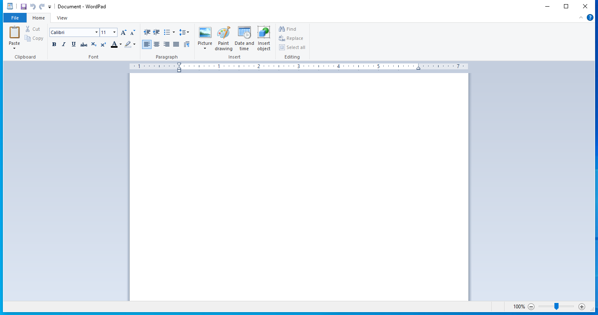
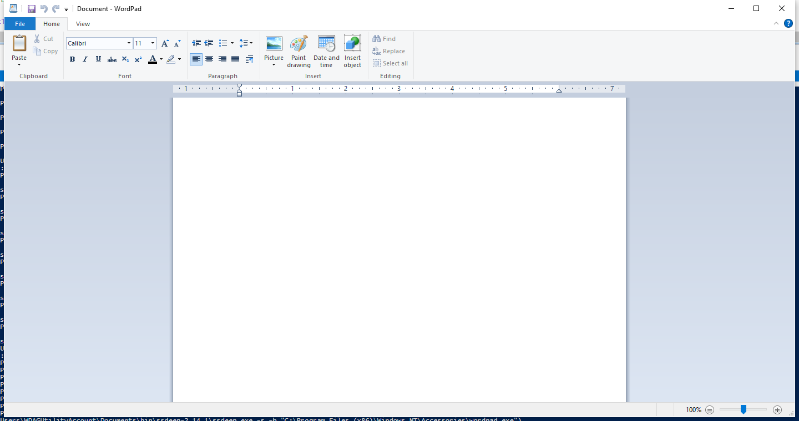

---
title: wordpad.exe | Windows Wordpad Application
excerpt: What is wordpad.exe?
---

# wordpad.exe 

* File Path: `C:\Program Files (x86)\windows nt\accessories\wordpad.exe`
* Description: Windows Wordpad Application

## Screenshot

## Hashes

Type | Hash
-- | --
MD5 | `AD2FB3DA4D8AA9D8764E92E46CF2518D`
SHA1 | `AC4C000E0139DF03AC48CA261EDD41F6C5321D17`
SHA256 | `C35624422AD35FEA2989387539908130CD9CEC17122AE9136C978DC91493EA9A`
SHA384 | `FD2D9B20473DE40D2AE1726EDE0198F8595B0327DEA0EA70183E4174ADC45BD64DD95CF9C0EB9D2EAD67B4F35798337C`
SHA512 | `40547C7DDD6EF429AADACCCCA85B5B6B10C122EC8E3010898614F4851824D501963EF60AECCBE07748CD072AA97C053D582282AF66CF959EFDC1D1C61A1ABB6B`
SSDEEP | `24576:I+mOVbV4AjtecTGbpigC2FxvNEtXcPCl9AuDF5zUPGLG5SvAMZAMg9ax:8OpqAjtecTohxvW9cPy9AuDzY4x`
IMP | `785E6D31910C9D8931D98C5E8B872F59`
PESHA1 | `EE70BA13AAF34F85E5C5C71B8EE0F1966D8EA504`
PE256 | `CC86D3B658EDB75E6A77FD6D56A5BC94F07B41EB09A145199A130B5E66995308`

## Runtime Data

### Window Title:
Document - WordPad

### Open Handles:

Path | Type
-- | --
(R-D)   C:\Program Files (x86)\windows nt\accessories\en-US\wordpad.exe.mui | File
(R-D)   C:\Windows\Fonts\StaticCache.dat | File
(R-D)   C:\Windows\System32\en-US\fms.dll.mui | File
(R-D)   C:\Windows\System32\en-US\KernelBase.dll.mui | File
(R-D)   C:\Windows\System32\en-US\MFC42u.dll.mui | File
(R-D)   C:\Windows\SysWOW64\en-US\UIRibbon.dll.mui | File
(RW-)   C:\Users\user\Documents | File
(RW-)   C:\Windows | File
(RW-)   C:\Windows\WinSxS\x86_microsoft.windows.common-controls_6595b64144ccf1df_6.0.17763.1518_none_261b62a767ca4e6d | File
(RW-)   C:\Windows\WinSxS\x86_microsoft.windows.gdiplus_6595b64144ccf1df_1.1.17763.1518_none_5706558cc25cc83b | File
\BaseNamedObjects\__ComCatalogCache__ | Section
\BaseNamedObjects\C:\*ProgramData\*Microsoft\*Windows\*Caches\*{6AF0698E-D558-4F6E-9B3C-3716689AF493}.2.ver0x0000000000000004.db | Section
\BaseNamedObjects\C:\*ProgramData\*Microsoft\*Windows\*Caches\*{DDF571F2-BE98-426D-8288-1A9A39C3FDA2}.2.ver0x0000000000000004.db | Section
\BaseNamedObjects\C:\*ProgramData\*Microsoft\*Windows\*Caches\*cversions.2.ro | Section
\BaseNamedObjects\NLS_CodePage_1252_3_2_0_0 | Section
\BaseNamedObjects\NLS_CodePage_437_3_2_0_0 | Section
\RPC Control\DSECF14 | Section
\Sessions\2\BaseNamedObjects\f14HWNDInterface:a09c8 | Section
\Sessions\2\BaseNamedObjects\SessionImmersiveColorPreference | Section
\Sessions\2\BaseNamedObjects\windows_shell_global_counters | Section
\Sessions\2\Windows\Theme2131664586 | Section
\Windows\Theme966197582 | Section

### Loaded Modules:

Path |
-- |
C:\Program Files (x86)\windows nt\accessories\wordpad.exe |
C:\Windows\SYSTEM32\ntdll.dll |
C:\Windows\System32\wow64.dll |
C:\Windows\System32\wow64cpu.dll |
C:\Windows\System32\wow64win.dll |

## Signature

* Status: Signature verified.
* Serial: `3300000266BD1580EFA75CD6D3000000000266`
* Thumbprint: `A4341B9FD50FB9964283220A36A1EF6F6FAA7840`
* Issuer: CN=Microsoft Windows Production PCA 2011, O=Microsoft Corporation, L=Redmond, S=Washington, C=US
* Subject: CN=Microsoft Windows, O=Microsoft Corporation, L=Redmond, S=Washington, C=US

## File Metadata

* Original Filename: WORDPAD.EXE.MUI
* Product Name: Microsoft Windows Operating System
* Company Name: Microsoft Corporation
* File Version: 10.0.17763.1075 (WinBuild.160101.0800)
* Product Version: 10.0.17763.1075
* Language: English (United States)
* Legal Copyright:  Microsoft Corporation. All rights reserved.
* Machine Type: 32-bit

## File Scan

* VirusTotal Detections: 0/67
* VirusTotal Link: https://www.virustotal.com/gui/file/c35624422ad35fea2989387539908130cd9cec17122ae9136c978dc91493ea9a/detection/

## File Similarity (ssdeep match)

File | Score
-- | --
[C:\Program Files\windows nt\accessories\wordpad.exe](wordpad.exe-8C90572B1F8F341D72E5417DE7F4418F.md) | 63

## Possible Misuse

*The following table contains possible examples of `wordpad.exe` being misused. While `wordpad.exe` is **not** inherently malicious, its legitimate functionality can be abused for malicious purposes.*

Source | Source File | Example | License
-- | -- | -- | --
[signature-base](https://github.com/Neo23x0/signature-base) | [apt_winnti_burning_umbrella.yar](https://github.com/Neo23x0/signature-base/blob/master/yara/apt_winnti_burning_umbrella.yar) | $s1 = "Wordpad.Document.1\\shell\\open\\command\\" fullword wide | [CC BY-NC 4.0](https://github.com/Neo23x0/signature-base/blob/master/LICENSE)
[signature-base](https://github.com/Neo23x0/signature-base) | [thor-hacktools.yar](https://github.com/Neo23x0/signature-base/blob/master/yara/thor-hacktools.yar) | $s3 = "Accessories\\wordpad.exe" fullword ascii | [CC BY-NC 4.0](https://github.com/Neo23x0/signature-base/blob/master/LICENSE)

MIT License. Copyright (c) 2020-2021 Strontic.

