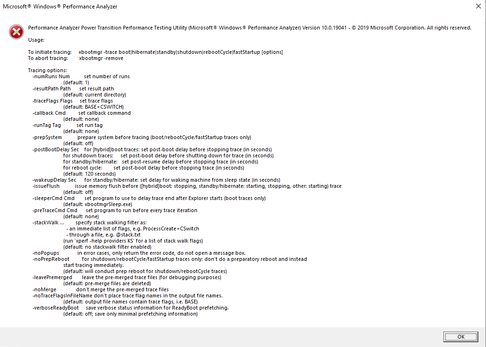

---
title: xbootmgr.exe | Performance Analyzer Power Transition Performance Testing Utility
excerpt: What is xbootmgr.exe?
---

# xbootmgr.exe 

* File Path: `C:\Program Files (x86)\Windows Kits\10\Windows Performance Toolkit\xbootmgr.exe`
* Description: Performance Analyzer Power Transition Performance Testing Utility

## Screenshot

## Hashes

Type | Hash
-- | --
MD5 | `DA8725BAF21A0AD86C07DF1539BE8898`
SHA1 | `F3CBC38B4BECA6007216C239DE037F6D27AA1A27`
SHA256 | `8F4B6FE4BEBB2451FA346F56021619CB856AA94EFA9D50C059EFE9F52BE033CF`
SHA384 | `61A5D91FBEC45BF3853ECBE519D8796CEA97B2BE95FEFB2BECBC11D1A272225326755D703C2F82E8F598E2EF9DD4440D`
SHA512 | `7DD9C1D3ECD1EE990E6D1906E9225C0B2056D83A903BB82067F589C434297E7768D8CC0526DDE5D4BEA0D81092E68167C353CF23023E66945B9FCA3341664418`
SSDEEP | `3072:SLpKgQLC98diQwGvyfcFg/G+K9g/Ovr+KexkXaFXGw:SLpnX98diQwGHqKsh`
IMP | `5633E87346C49426A8A8D27B88683523`
PESHA1 | `6C3E743EB1443AB745907D20469355FABD609AA6`
PE256 | `DAE95761C9CD93CCB49588F0A8397319D6A7B0E5F0FD8A5A008E7BC177710147`

## Runtime Data

### Window Title:
Microsoft Windows Performance Analyzer

### Open Handles:

Path | Type
-- | --
(R-D)   C:\Windows\Fonts\StaticCache.dat | File
(RW-)   C:\Users\user | File
\BaseNamedObjects\C:\*ProgramData\*Microsoft\*Windows\*Caches\*{6AF0698E-D558-4F6E-9B3C-3716689AF493}.2.ver0x0000000000000002.db | Section
\BaseNamedObjects\C:\*ProgramData\*Microsoft\*Windows\*Caches\*{DDF571F2-BE98-426D-8288-1A9A39C3FDA2}.2.ver0x0000000000000002.db | Section
\BaseNamedObjects\C:\*ProgramData\*Microsoft\*Windows\*Caches\*cversions.2 | Section
\BaseNamedObjects\NLS_CodePage_1252_3_2_0_0 | Section
\BaseNamedObjects\NLS_CodePage_437_3_2_0_0 | Section
\Sessions\1\Windows\Theme1383959086 | Section
\Windows\Theme2042523233 | Section

### Loaded Modules:

Path |
-- |
C:\Program Files (x86)\Windows Kits\10\Windows Performance Toolkit\xbootmgr.exe |
C:\Windows\System32\ADVAPI32.dll |
C:\Windows\System32\GDI32.dll |
C:\Windows\System32\gdi32full.dll |
C:\Windows\System32\KERNEL32.DLL |
C:\Windows\System32\KERNELBASE.dll |
C:\Windows\System32\msvcp_win.dll |
C:\Windows\System32\msvcrt.dll |
C:\Windows\SYSTEM32\ntdll.dll |
C:\Windows\System32\RPCRT4.dll |
C:\Windows\System32\sechost.dll |
C:\Windows\System32\ucrtbase.dll |
C:\Windows\System32\win32u.dll |

## Signature

* Status: Signature verified.
* Serial: `33000002CF6D2CC57CAA65A6D80000000002CF`
* Thumbprint: `1A221B3B4FEF088B17BA6704FD088DF192D9E0EF`
* Issuer: CN=Microsoft Code Signing PCA 2010, O=Microsoft Corporation, L=Redmond, S=Washington, C=US
* Subject: CN=Microsoft Corporation, O=Microsoft Corporation, L=Redmond, S=Washington, C=US

## File Metadata

* Original Filename: xbootmgr.exe
* Product Name: Microsoft Windows Performance Analyzer
* Company Name: Microsoft Corporation
* File Version: 10.0.19041.1 (WinBuild.160101.0800)
* Product Version: 10.0.19041.1
* Language: English (United States)
* Legal Copyright:  2019 Microsoft Corporation. All rights reserved.
* Machine Type: 64-bit

## File Scan

* VirusTotal Detections: 0/75
* VirusTotal Link: https://www.virustotal.com/gui/file/8f4b6fe4bebb2451fa346f56021619cb856aa94efa9d50c059efe9f52be033cf/detection

MIT License. Copyright (c) 2020-2021 Strontic.

